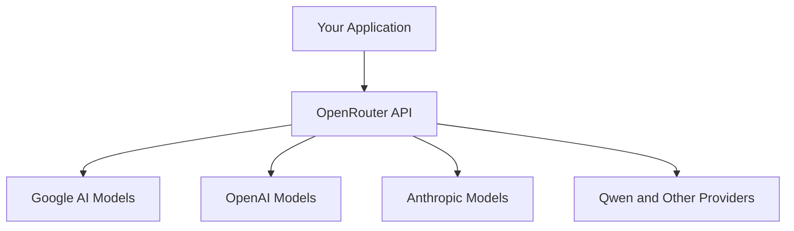
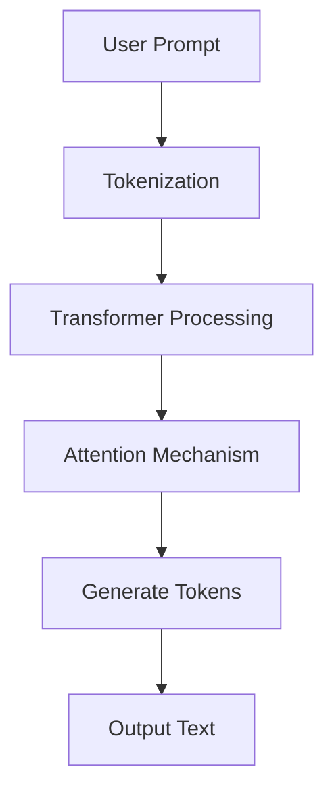
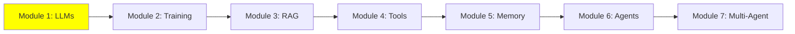

# Module 1: Large Language Model (LLM) Fundamentals

Welcome to the first module of our AI tutorial series! As your expert tutor, I'll guide you through the basics of Large Language Models (LLMs) in a clear, step-by-step way. We'll use simple examples, visuals, and diagrams to make learning fun and easy. Remember, LLMs are powerful tools, but understanding them helps you use them wisely.

## I. Introduction to Large Language Models (LLMs)

### A. Core Definition

What are LLMs? They're just models that take text as input and output text. You give them a prompt, and they generate a response based on patterns learned from training data.

Imagine an LLM as a super-smart text machine. You give it some words (called a **prompt**), and it replies with more words (called **generation**). It's like chatting with a knowledgeable friend who predicts what you'll say next.

At its heart, an LLM is a deep learning model trained on huge amounts of text from books, websites, and more. It learns patterns in language to guess the most likely next word in a sentence.

Here's a simple ASCII art to visualize it:

```
User Input (Prompt): "The sky is"
LLM Brain: [Magic Processing]
Output: "blue."
```

### B. Key Parameters: Temperature, Max Output Tokens, Context Window

LLMs have settings to control output:

- **Temperature**: 0.0 to 1.0. Low (0.1-0.3) for accurate, consistent answers (good for code). High (0.9) for creative but risky.

- **Max Output Tokens**: Limits response length to save costs.

- **Context Window**: Max text (input + output) per call. Exceeded? Truncation or errors.

### C. Context Window Limitations

The context window is a big limit. It prevents processing huge codebases. That's why RAG helps—pulls in extra info.

ASCII Art for Context Window:
```
Context Window: [Input Text] + [Output Text] <= Limit
If too much: [Input Text] ... [Truncated!]
```

## II. Controlling Output and Understanding Constraints

LLMs are amazing, but they have limits. Let's learn how to control them.

### A. Context Window: The Critical Limitation

Every LLM has a **context window**—the maximum amount of text (input + output) it can handle in one go. It's like the model's memory limit.

- **Why it matters**: If your project involves big codebases or long documents, the context window can get full quickly. That's why techniques like RAG (Retrieval-Augmented Generation) exist—to pull in extra info without overloading the model.
- **What happens if exceeded**: The model might cut off your input (truncation) or give incomplete answers.

ASCII Art for Context Window:
```
Context Window: [Input Text] + [Output Text] <= Limit
If too much: [Input Text] ... [Truncated!]
```

### B. Key Generation Parameters

You can tweak settings to change how the LLM responds. Here are the main ones:

1. **Temperature**:
   - **Definition**: A number from 0.0 to 1.0 that controls creativity. Low (e.g., 0.1) means predictable, accurate answers. High (e.g., 0.9) means more creative but less reliable.
   - **For your projects**: Use low temperatures (0.1–0.3) for tasks like code analysis or tutorials, where you need consistency over fun stories.

2. **Max Output Tokens**:
   - **Definition**: The maximum length of the LLM's reply.
   - **Control**: Set this to save money on API calls and avoid super-long responses. For example, limit to 100 tokens for quick answers.

## III. LLM Deployment and Optimization

Now, how do you actually use an LLM? Inference needs GPU for larger models, so cloud or local.

### A. Inference Execution Methods

1. **Cloud-Based Inference (API Calls)**:
   - Run LLMs through online services like ChatGPT or Google AI Studio.
   - **Pros**: Access to huge, powerful models. No need for fancy hardware.
   - **Cons**: Costs money, needs internet, might be slow.

2. **Local Inference**:
   - Run the LLM right on your computer.
   - **Requirement**: A good GPU (graphics card) with enough memory (VRAM).
   - **Benefit**: Free after setup, works offline.

### B. Model Optimization: Quantization

**What is Quantization?** It's like compressing a big file to make it smaller. We reduce the model's "weight" precision from 32-bit to 4-bit, shrinking it so it fits on regular GPUs.

**Benefit**: Lets you run big LLMs locally on everyday laptops, saving resources.

**Good news**: you usually don't need to quantize a model yourself. [Ollama](https://ollama.com/) already ships ready-made, pre-quantized versions of popular models (Llama, Mistral, Gemma, and more) — just pull one and run it.

### C. Local LLM Tools

Here are easy tools to get started locally:

- **LMStudio** ([lmstudio.ai](https://lmstudio.ai/)): A simple GUI for downloading and chatting with LLMs. Great for beginners!
- **Ollama** ([ollama.com](https://ollama.com/)): A command-line tool for quick setup and serving models. Perfect for advanced users.

## IV. API Access Strategy for the Project

For your projects, you'll need access to LLMs. Here's how:

### A. Google AI Studio API Key (Primary Access)

- **Recommendation**: Start with Google AI Studio ([aistudio.google.com](https://aistudio.google.com/)). It has a free tier with daily limits for basic models.
- **Action**: Sign up and get your personal API key.

### B. OpenRouter (Unified Gateway)

- **What it is**: Instead of separate keys for Google, OpenAI, Qwen, etc., get one OpenRouter key to access almost all models from different providers ([openrouter.ai](https://openrouter.ai/)).
- **Benefit**: Free models with daily limits (beyond Google), easy switching for testing.

Here's a Mermaid diagram showing how OpenRouter works as a gateway:



### C. Local Model Option

If you have a capable laptop (good GPU), run LLMs locally for zero cost after setup. Use LMStudio or Ollama!

## V. Basic Prompt Engineering

Prompt engineering is the art of crafting good prompts to get better LLM responses. It's like giving clear instructions to a student.

**Key Tips**:
- Be specific: Instead of "Write code," say "Write a Python function to add two numbers."
- Use examples: Show what you want, e.g., "Example: Input 2+3, Output 5."
- Experiment: Try different phrasings.

For inspiration, check these resources:
- [System Prompts and Models](https://github.com/x1xhlol/system-prompts-and-models-of-ai-tools)
- [System Prompts Leaks](https://github.com/asgeirtj/system_prompts_leaks)
- [Leaked System Prompts](https://github.com/jujumilk3/leaked-system-prompts)

Practice: Try prompting an LLM to explain a simple concept, like "What is a loop in programming?"

## Mermaid Diagram: LLM Workflow

Here's a visual flow of how an LLM works:



## Tutorial Progress

Here's where we are in the series:



## Summary

You've learned the basics of LLMs: what they are, how they work, their limits, and how to use them. Next, we'll explore RAG to handle bigger tasks. Keep practicing with prompts—it's key to mastering AI!

**Quiz Yourself**: What is a context window? Why use low temperature for code tasks?

Happy learning! 🚀

**Next Module:** [Module 2: Training LLMs](2_training.md)
