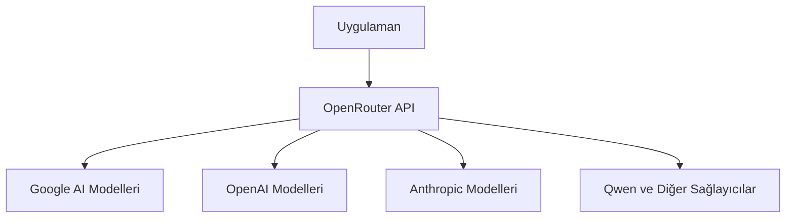
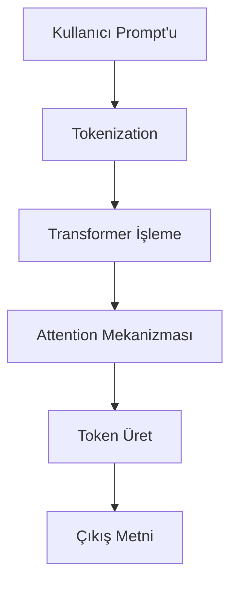
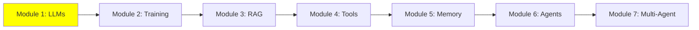

# Module 1: Large Language Model (LLM) Fundamentals

## I. Large Language Models (LLM'ler) Hakkında Giriş

### A. Temel Tanım

LLM'ler nedir? Sadece metin girişi alıp metin çıkışı veren modeller. Onlara bir prompt verirsin, eğitim verilerinden öğrendiği kalıplara göre yanıt üretir.

Bir LLM'yi süper akıllı bir metin makinesi olarak hayal et. Bazı kelimeler verirsin (buna **prompt** denir), o da daha fazla kelimeyle yanıt verir (buna **generation** denir). Bilgili bir arkadaşla sohbet etmek gibi, ne diyeceğini tahmin eder.

Kalbinde, kitaplar, web siteleri ve daha fazlasından oluşan devasa metin verileri üzerinde eğitilmiş derin öğrenme modeli var. Dil kalıplarını öğrenerek bir cümlede sonraki en olası kelimeyi tahmin eder.

Bunu görselleştirmek için basit bir ASCII art:

```
Kullanıcı Girişi (Prompt): "Gökyüzü"
LLM Beyni: [Sihirli İşleme]
Çıkış: "mavi."
```

### B. Ana Parametreler: Temperature, Max Output Tokens, Context Window

LLM'lerde çıkışı kontrol eden ayarlar var:

- **Temperature**: 0.0'dan 1.0'a. Düşük (0.1-0.3) doğru, tutarlı yanıtlar için (kod için iyi). Yüksek (0.9) yaratıcı ama riskli.
- **Max Output Tokens**: Yanıt uzunluğunu sınırlar, maliyetten tasarruf için.
- **Context Window**: Bir çağrıda maksimum metin (giriş + çıkış). Aşıldı mı? Kesme veya hatalar.

### C. Context Window Sınırlamaları

Context window büyük bir sınırlama. Devasa kod tabanlarını işlemeyi engeller. Bu yüzden RAG yardımcı olur—ekstra bilgi çeker.

Context Window için ASCII Art:

```
Context Window: [Giriş Metni] + [Çıkış Metni] <= Limit
Çok fazla: [Giriş Metni] ... [Kesildi!]
```

## II. Çıkışı Kontrol Etme ve Sınırlamaları Anlama

LLM'ler harika, ama sınırları var. Onları nasıl kontrol edeceğimizi öğrenelim.

### A. Context Window: Kritik Sınırlama

Her LLM'nin bir **context window**u var—bir seferde işleyebileceği maksimum metin miktarı. Modelin hafıza limiti gibi.

Bunu, seninle ChatGPT arasındaki sohbet geçmişi gibi düşün. Yeni bir konuşmanın en başında tamamen boştur. Konuştukça, bu geçmiş—senin (insan) mesajların ve AI'nin yanıtları—context window'a eklenmeye devam eder, ta ki sonunda dolana kadar.

- **Neden önemli**: Projenizde büyük kod tabanları veya uzun belgeler varsa, context window çabuk dolar. Bu yüzden RAG gibi teknikler var—modeli aşırı yüklemeden ekstra bilgi çeker.
- **Aşıldığında ne olur**: Model girişinizi kesebilir (truncation) veya eksik yanıtlar verebilir.


### B. Ana Üretim Parametreleri

LLM'nin nasıl yanıt vereceğini ayarlayabilirsin. İşte ana olanlar:

1. **Temperature**:

   - **Tanım**: 0.0'dan 1.0'a yaratıcılığı kontrol eden sayı. Düşük (ör. 0.1) tahmin edilebilir, doğru yanıtlar. Yüksek (ör. 0.9) daha yaratıcı ama güvenilmez.
   - **Projelerin için**: Kod analizi veya eğitim gibi görevlerde tutarlılık için düşük temperature kullan (0.1–0.3), eğlenceli hikayelerden çok.
2. **Max Output Tokens**:

   - **Tanım**: LLM yanıtının maksimum uzunluğu.
   - **Kontrol**: API maliyetlerinden tasarruf etmek ve süper uzun yanıtları önlemek için ayarla. Örneğin, hızlı yanıtlar için 100 token'a sınırla.

## III. LLM Dağıtımı ve Optimizasyonu

Şimdi bir LLM'yi nasıl gerçekten kullanırsın? Büyük modeller için inference GPU gerektirir, yani bulut veya yerel.

### A. Inference Yürütme Yöntemleri

1. **Bulut Tabanlı Inference (API Çağrıları)**:

   - ChatGPT veya Google AI Studio gibi çevrimiçi servisler üzerinden LLM'leri çalıştır.
   - **Artıları**: Devasa, güçlü modellere erişim. Fancy donanım gerekmez.
   - **Eksileri**: Para tutar, internet lazım, yavaş olabilir.
2. **Yerel Inference**:

   - LLM'yi kendi bilgisayarında çalıştır.
   - **Gereksinim**: İyi bir GPU (grafik kartı) ve yeterli bellek (VRAM).
   - **Fayda**: Kurulum sonrası ücretsiz, çevrimdışı çalışır.

### B. Model Optimizasyonu: Quantization

**Quantization nedir?** Büyük bir dosyayı sıkıştırmak gibi. Modelin ağırlık hassasiyetini 32-bit'ten 4-bit'e düşürürüz, böylece sıradan GPU'larda sığar.

**Fayda**: Günlük laptop'larda büyük LLM'leri yerel olarak çalıştırmayı sağlar, kaynak tasarrufu.

**İyi haber**: modeli genelde kendin quantize etmene gerek yok. [Ollama](https://ollama.com/) popüler modellerin (Llama, Mistral, Gemma ve daha fazlası) hazır, önceden quantize edilmiş versiyonlarını sunuyor—sadece indir (pull) ve çalıştır.

### C. Yerel LLM Araçları

Yerel olarak başlamak için kolay araçlar:

- **LMStudio** ([lmstudio.ai](https://lmstudio.ai/)): LLM'leri indirmek ve sohbet etmek için basit GUI. Başlangıç seviyesindekiler için harika!
- **Ollama** ([ollama.com](https://ollama.com/)): Hızlı kurulum ve model sunma için komut satırı aracı. İleri seviyedekiler için mükemmel.

## IV. Proje İçin API Erişim Stratejisi

Projelerin için LLM'lere erişim lazım. İşte nasıl:

### A. Google AI Studio API Anahtarı (Birincil Erişim)

- **Öneri**: Google AI Studio ile başla ([aistudio.google.com](https://aistudio.google.com/)). Temel modeller için günlük limitlerle ücretsiz seviye var.
- **Eylem**: Kaydol ve kişisel API anahtarını al.

### B. OpenRouter (Birleşik Ağ Geçidi)

- **Ne olduğu**: Google, OpenAI, Qwen vb. için ayrı anahtarlar yerine, farklı sağlayıcılardan neredeyse tüm modellere erişmek için bir OpenRouter anahtarı al ([openrouter.ai](https://openrouter.ai/)).
- **Fayda**: Google dışındaki ücretsiz modellerle günlük limitler, test için kolay geçiş.

OpenRouter'ın nasıl ağ geçidi olarak çalıştığını gösteren Mermaid diyagramı:



### C. Yerel Model Seçeneği

Yetenekli bir laptop'un varsa (iyi GPU), kurulum sonrası sıfır maliyetle LLM'leri yerel çalıştır. LMStudio veya Ollama kullan!

## V. Temel Prompt Mühendisliği

Prompt mühendisliği, LLM'lerden daha iyi yanıt almak için iyi prompt'lar oluşturma sanatı. Bir öğrenciye net talimat vermek gibi.

**Ana İpuçları**:

- Spesifik ol: "Kod yaz" yerine "İki sayıyı toplayan Python fonksiyonu yaz."
- Örnekler kullan: İstediğini göster, örn. "Örnek: Giriş 2+3, Çıkış 5."
- Deney: Farklı ifadeler dene.

İlham için bu kaynaklara bak:

- [System Prompts and Models](https://github.com/x1xhlol/system-prompts-and-models-of-ai-tools)
- [System Prompts Leaks](https://github.com/asgeirtj/system_prompts_leaks)
- [Leaked System Prompts](https://github.com/jujumilk3/leaked-system-prompts)

Uygulama: Basit bir kavramı açıklaması için LLM'ye prompt ver, mesela "Programlamada döngü nedir?"

## Mermaid Diyagramı: LLM İş Akışı

LLM'nin nasıl çalıştığını gösteren görsel akış:



## Eğitim İlerlemesi

Seride neredeyiz:



## Özet

LLM'lerin temellerini öğrendin: Ne oldukları, nasıl çalıştıkları, sınırları ve kullanımı. Sonra RAG ile daha büyük görevleri keşfedeceğiz. Prompt'larla pratik yap—AI'yi ustalaşmanın anahtarı!

**Kendini Sınav Et**: Context window nedir? Kod görevlerinde neden düşük temperature kullan?

Mutlu öğrenmeler! 🚀

**Sonraki Modül:** [Modül 2: Training LLM&#39;ler](2_training_tr.md)
