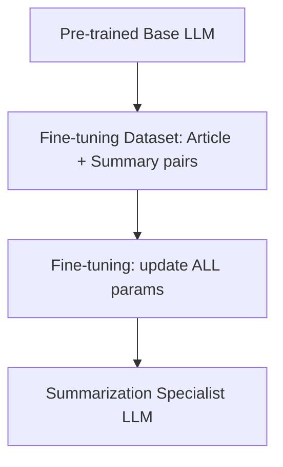
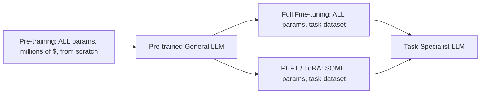
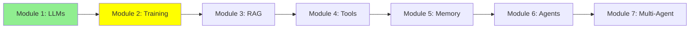

# Module 2: Training LLMs — From General Brain to Specialist

Hello again! In Module 1, we learned what LLMs are and how to use them. But how does an LLM learn everything it knows in the first place, and how do we make it really good at one specific job? That's what this module is about: pre-training, fine-tuning, and a cheaper way to fine-tune called PEFT.

## I. Pre-training: How an LLM Is Born

Before an LLM can chat with you, it has to learn language from scratch. This first, huge training step is called **pre-training**.

- The model starts with random, untrained parameters (its "weights").
- It reads a massive slice of the internet — books, websites, code, articles — and learns to predict the next word, over and over, billions of times.
- During pre-training, **all** of the model's parameters get updated. For a large model, that's billions of numbers changing.
- This takes thousands of GPUs running for weeks or months. That's why pre-training a large model from scratch costs **millions of dollars** — only a handful of big labs (OpenAI, Google, Anthropic, Meta, etc.) can afford to do it.

ASCII Art:
```
Huge Internet Data --> [Pre-training: update ALL params] --> General-Purpose LLM
                                  (millions of $$$, weeks of GPUs)
```

The result is a **general-purpose** model: good at many things, but not specialized in anything.

## II. Fine-tuning: Teaching an LLM One Job Really Well

Luckily, you don't need to pre-train your own LLM. Someone else already spent the millions of dollars — you can start from their pre-trained model and just **fine-tune** it.

**Fine-tuning** means: take an already pre-trained model, and keep training it — this time on a smaller, task-specific dataset — so it becomes better at one particular job.

### Example: Fine-tuning for Summarization

Say you want a model that's really good at summarizing articles.

1. Start with a pre-trained base model.
2. Collect a dataset of examples: `(long article, human-written short summary)` pairs — maybe a few thousand of them.
3. Keep training the model on these pairs so it learns the pattern "long text in → short, accurate summary out."
4. The result is a model that's noticeably more consistent and better at summarization than the generic base model — without paying for pre-training.

Here's what a handful of training rows might actually look like — this is exactly what the model sees, over and over, during step 3:

| Article (Input) | Human Summary (Output) |
|---|---|
| "The city opened three new public parks this year, adding over 50 acres of green space. Officials say the parks will host weekend markets and free yoga classes starting next spring." | "The city added 50 acres of new parks, which will host markets and yoga classes." |
| "Scientists discovered a new species of frog in the Amazon rainforest. The frog has bright blue skin and is only 2 cm long, making it one of the smallest amphibians ever recorded." | "A tiny, 2cm blue frog was discovered in the Amazon — one of the smallest amphibians on record." |
| "The company's quarterly earnings report showed a 15% increase in revenue, driven mainly by strong sales in its cloud computing division." | "The company's revenue grew 15% this quarter, led by cloud computing sales." |
| "A new study found that drinking coffee in moderation may reduce the risk of heart disease. Researchers tracked 10,000 participants over five years." | "A 5-year study of 10,000 people found moderate coffee drinking may lower heart disease risk." |
| "The local football team won their championship game 3-1, securing their first title in a decade." | "The team won the championship 3-1, their first title in ten years." |

By seeing thousands of pairs like these, the model doesn't memorize the answers — it learns the *pattern*: take the key facts from a longer text and compress them into one short, plain sentence.

### Before vs. After: Does It Actually Work?

Let's test it on a brand-new article the model has never seen before — not one from the table above.

**Test Article**:
> "The tech startup announced today that it raised $50 million in Series B funding, led by two major venture capital firms. The company plans to use the funds to expand its engineering team and launch operations in three new countries by next year."

**Base Model Output (before fine-tuning)**:
> "This is an interesting piece of news about a technology startup. The article talks about how the company managed to secure a significant amount of funding, specifically $50 million, in what is known as a Series B funding round, which was led by two prominent venture capital firms. According to the article, the startup intends to allocate this capital towards growing its engineering department and expanding its business operations into three additional countries within the coming year."

**Fine-tuned Model Output (after fine-tuning)**:
> "The startup raised $50 million in Series B funding to grow its engineering team and expand into three new countries next year."

Notice the difference: the base model rambles, restates the article almost sentence-by-sentence, and adds filler like "This is an interesting piece of news." The fine-tuned model learned the *pattern* from the table above — one tight, plain sentence with just the key facts — and applies it to a completely new article it's never seen.

A tiny, simplified example using Hugging Face `transformers`:

```python
from transformers import AutoModelForSeq2SeqLM, AutoTokenizer, Trainer, TrainingArguments

model = AutoModelForSeq2SeqLM.from_pretrained("t5-small")  # already pre-trained
tokenizer = AutoTokenizer.from_pretrained("t5-small")

# dataset = a list of {"article": "...", "summary": "..."} pairs
trainer = Trainer(
    model=model,
    args=TrainingArguments(output_dir="./summarizer", num_train_epochs=3),
    train_dataset=dataset,  # your (article, summary) pairs
)
trainer.train()  # updates ALL of the model's parameters
```

This is called **full fine-tuning** because every parameter in the model gets updated — same as pre-training, just on a much smaller dataset. It's cheaper than pre-training, but for big models it can still need serious GPU memory.

Diagram:


## III. PEFT: Parameter-Efficient Fine-Tuning (the Cheap, Common Way)

Full fine-tuning updates every parameter — for a big model, that still means huge GPUs and a lot of memory. Most of us don't have that.

**PEFT (Parameter-Efficient Fine-Tuning)** solves this: instead of updating all the model's parameters, we **freeze almost the whole model** and only train a small number of new, extra parameters.

- The frozen part stays exactly as it was after pre-training.
- Only a tiny slice of parameters (often less than 1% of the total) actually changes.
- The most common PEFT technique is called **LoRA** (Low-Rank Adaptation) — you don't need the math, just know it's the "cheap fine-tuning" trick almost everyone uses.

**Benefit**: Runs on a single consumer GPU, trains much faster, and produces a small file (just the extra parameters) instead of a whole new copy of the model. This is what we use most of the time in real projects.

A tiny, simplified PEFT/LoRA example using Hugging Face `peft`:

```python
from peft import LoraConfig, get_peft_model
from transformers import AutoModelForSeq2SeqLM

model = AutoModelForSeq2SeqLM.from_pretrained("t5-small")  # frozen base model

lora_config = LoraConfig(r=8, task_type="SEQ_2_SEQ_LM")
model = get_peft_model(model, lora_config)  # wraps model, freezes base, adds small trainable layers

model.print_trainable_parameters()
# something like: "trainable params: 0.3M || all params: 60M || trainable%: 0.5%"
```

Note: quantization is a different trick for shrinking model *size*, and we already covered it in Module 1 — don't confuse the two. PEFT is about training cheaply; quantization is about running cheaply.

## IV. Quick Comparison

| | Pre-training | Full Fine-tuning | PEFT (e.g. LoRA) |
|---|---|---|---|
| Starting point | Random weights | Pre-trained model | Pre-trained model |
| Data needed | Whole internet | Task-specific dataset | Task-specific dataset |
| Params updated | ALL (from scratch) | ALL | SOME (often <1%) |
| Typical cost | Millions of dollars | Expensive, but far less than pre-training | Cheap — fits on one GPU |
| Who does it | A handful of big AI labs | Companies with real budgets | Most of us, most of the time |

## Mermaid Diagram: Pre-training vs. Fine-tuning vs. PEFT



## Tutorial Progress



## Summary

You now know the difference between pre-training (expensive, general), full fine-tuning (specializing, still pricey), and PEFT (cheap, specializing, what most of us actually use). But even a fine-tuned model still doesn't know about your private codebase or live data — that's exactly the gap RAG fills. Onward to Module 3!

**Quick Check**: What's the difference between full fine-tuning and PEFT? Why is pre-training so expensive?

Keep going! 🚀

**Previous Module:** [Module 1: Large Language Model (LLM) Fundamentals](1_llms.md)
**Next Module:** [Module 3: Retrieval-Augmented Generation (RAG)](3_rag.md)
