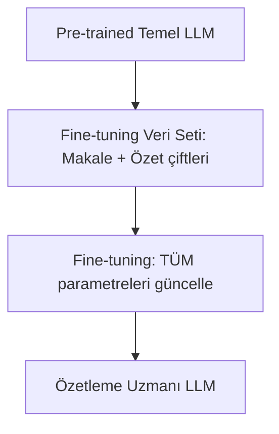
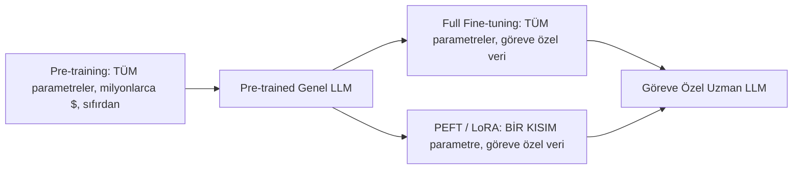
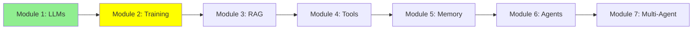

# Module 2: Training LLMs — Genel Beyinden Uzmana

Tekrar merhaba! Modül 1'de LLM'lerin ne olduğunu ve nasıl kullanıldığını öğrendik. Ama bir LLM tüm bu bilgiyi nereden öğreniyor, ve onu belirli bir işte gerçekten iyi yapmak için ne yapıyoruz? Bu modül tam olarak bunu anlatıyor: pre-training, fine-tuning ve PEFT denen daha ucuz bir fine-tuning yolu.

## I. Pre-training: Bir LLM Nasıl Doğar?

Bir LLM seninle sohbet edebilmeden önce, dili sıfırdan öğrenmesi gerekir. Bu ilk, devasa eğitim adımına **pre-training** denir.

- Model, rastgele ve eğitilmemiş parametrelerle (ağırlıklarla) başlar.
- İnternetin devasa bir dilimini okur—kitaplar, web siteleri, kod, makaleler—ve sıradaki kelimeyi tahmin etmeyi milyarlarca kez tekrar tekrar öğrenir.
- Pre-training sırasında modelin **tüm** parametreleri güncellenir. Büyük bir model için bu, milyarlarca sayının değişmesi demek.
- Bu, binlerce GPU'nun haftalarca veya aylarca çalışmasını gerektirir. Bu yüzden büyük bir modeli sıfırdan pre-train etmek **milyonlarca dolara** mal olur—sadece birkaç büyük şirket (OpenAI, Google, Anthropic, Meta vb.) bunu yapabilir.

ASCII Art:
```
Devasa İnternet Verisi --> [Pre-training: TÜM parametreleri güncelle] --> Genel Amaçlı LLM
                                    (milyonlarca $, haftalarca GPU)
```

Sonuç, **genel amaçlı** bir model: çok şeyde iyi, ama hiçbir şeyde uzmanlaşmamış.

## II. Fine-tuning: Bir LLM'ye Bir İşi Çok İyi Öğretmek

İyi haber: kendi LLM'ini pre-train etmene gerek yok. Başka biri milyonlarca doları zaten harcadı—onların pre-trained modelinden başlayıp sadece **fine-tune** edebilirsin.

**Fine-tuning**, zaten pre-trained olan bir modeli almak ve—bu kez daha küçük, göreve özel bir veri setinde—eğitime devam ederek onu belirli bir işte daha iyi hale getirmek demektir.

### Örnek: Özetleme İçin Fine-tuning

Makaleleri özetlemede çok iyi bir model istediğini düşün.

1. Pre-trained bir temel modelle başla.
2. Örnek veri seti topla: `(uzun makale, insan tarafından yazılmış kısa özet)` çiftleri—belki birkaç bin tane.
3. Modeli bu çiftler üzerinde eğitmeye devam et, böylece "uzun metin gir → kısa, doğru özet çık" kalıbını öğrensin.
4. Sonuç: pre-training'e para ödemeden, genel temel modelden çok daha tutarlı ve özetlemede daha iyi bir model.

Bir avuç eğitim satırı gerçekte şöyle görünebilir—3. adımda model tam olarak bunu, tekrar tekrar görür:

| Makale (Girdi) | İnsan Özeti (Çıktı) |
|---|---|
| "Şehir bu yıl 50 dönümden fazla yeşil alan ekleyen üç yeni halk parkı açtı. Yetkililer, parkların gelecek bahar hafta sonu pazarlarına ve ücretsiz yoga derslerine ev sahipliği yapacağını söyledi." | "Şehir, hafta sonu pazarları ve yoga dersleri için kullanılacak 50 dönümlük yeni parklar ekledi." |
| "Bilim insanları Amazon yağmur ormanlarında yeni bir kurbağa türü keşfetti. Kurbağa parlak mavi tenli ve sadece 2 cm boyunda, bu da onu kayıtlara geçen en küçük amfibilerden biri yapıyor." | "Amazon'da 2 cm'lik mavi bir kurbağa keşfedildi—kayıtlardaki en küçük amfibilerden biri." |
| "Şirketin üç aylık kâr raporu, özellikle bulut bilişim biriminde güçlü satışların yönlendirdiği %15'lik bir gelir artışı gösterdi." | "Şirketin geliri bu çeyrekte bulut bilişim satışlarının öncülüğünde %15 arttı." |
| "Yeni bir çalışma, ölçülü kahve içmenin kalp hastalığı riskini azaltabileceğini buldu. Araştırmacılar beş yıl boyunca 10.000 katılımcıyı takip etti." | "10.000 kişiyle yapılan 5 yıllık bir çalışma, ölçülü kahve içmenin kalp hastalığı riskini azaltabileceğini buldu." |
| "Yerel futbol takımı şampiyonluk maçını 3-1 kazanarak on yıl içindeki ilk unvanını aldı." | "Takım şampiyonluğu 3-1 kazandı, on yılın ilk unvanı." |

Bu tür binlerce çifti görerek model cevapları ezberlemez—*kalıbı* öğrenir: daha uzun bir metindeki temel gerçekleri al, kısa ve sade bir cümleye sıkıştır.

### Öncesi ve Sonrası: Gerçekten İşe Yarıyor mu?

Modelin daha önce görmediği, yukarıdaki tablodan olmayan yepyeni bir makale üzerinde test edelim.

**Test Makalesi**:
> "Teknoloji girişimi bugün, iki büyük risk sermayesi firmasının liderlik ettiği Series B finansmanında 50 milyon dolar topladığını açıkladı. Şirket, fonu mühendislik ekibini büyütmek ve gelecek yıla kadar üç yeni ülkede operasyon başlatmak için kullanmayı planlıyor."

**Temel Model Çıktısı (fine-tuning öncesi)**:
> "Bu, bir teknoloji girişimi hakkında ilginç bir haber. Makale, şirketin Series B finansman turu olarak bilinen ve iki önde gelen risk sermayesi firmasının liderlik ettiği bir turda, özellikle 50 milyon dolar gibi önemli bir miktarda fon sağlamayı nasıl başardığından bahsediyor. Makaleye göre, girişim bu sermayeyi mühendislik departmanını büyütmeye ve iş operasyonlarını gelecek yıl içinde üç ek ülkeye genişletmeye ayırmayı planlıyor."

**Fine-tuned Model Çıktısı (fine-tuning sonrası)**:
> "Girişim, mühendislik ekibini büyütmek ve gelecek yıl üç yeni ülkeye açılmak için Series B finansmanında 50 milyon dolar topladı."

Farkı fark et: temel model dallanıp budaklanıyor, makaleyi neredeyse cümle cümle tekrar ediyor ve "Bu ilginç bir haber" gibi doldurmalar ekliyor. Fine-tuned model ise yukarıdaki tablodan öğrendiği *kalıbı*—sadece temel gerçekleri içeren tek, sıkı bir cümle—daha önce hiç görmediği tamamen yeni bir makaleye uyguluyor.

Hugging Face `transformers` ile küçük, basitleştirilmiş bir örnek:

```python
from transformers import AutoModelForSeq2SeqLM, AutoTokenizer, Trainer, TrainingArguments

model = AutoModelForSeq2SeqLM.from_pretrained("t5-small")  # zaten pre-trained
tokenizer = AutoTokenizer.from_pretrained("t5-small")

# dataset = {"article": "...", "summary": "..."} çiftlerinden oluşan liste
trainer = Trainer(
    model=model,
    args=TrainingArguments(output_dir="./summarizer", num_train_epochs=3),
    train_dataset=dataset,  # (makale, özet) çiftlerin
)
trainer.train()  # modelin TÜM parametrelerini günceller
```

Buna **full fine-tuning** denir çünkü modeldeki her parametre güncellenir—pre-training ile aynı, sadece çok daha küçük bir veri setinde. Pre-training'den ucuzdur, ama büyük modeller için hâlâ ciddi GPU belleği gerektirebilir.

Diyagram:


## III. PEFT: Parameter-Efficient Fine-Tuning (Ucuz ve Yaygın Yol)

Full fine-tuning her parametreyi güncelliyor—büyük bir model için bu hâlâ devasa GPU'lar ve çok bellek demek. Çoğumuzun buna gücü yetmiyor.

**PEFT (Parameter-Efficient Fine-Tuning)** bunu çözüyor: modelin tüm parametrelerini güncellemek yerine, **modelin neredeyse tamamını dondurup** sadece küçük bir miktar yeni, ekstra parametreyi eğitiyoruz.

- Dondurulan kısım, pre-training'den sonraki haliyle tamamen aynı kalır.
- Sadece parametrelerin çok küçük bir dilimi (genellikle toplamın %1'inden azı) gerçekten değişir.
- En yaygın PEFT tekniğine **LoRA** (Low-Rank Adaptation) denir—matematiğini bilmene gerek yok, sadece herkesin kullandığı "ucuz fine-tuning" hilesi olduğunu bil.

**Fayda**: Tek bir tüketici GPU'sunda çalışır, çok daha hızlı eğitilir, ve modelin tamamen yeni bir kopyası yerine küçük bir dosya (sadece ekstra parametreler) üretir. Gerçek projelerde çoğu zaman kullandığımız yöntem bu.

Hugging Face `peft` ile küçük, basitleştirilmiş bir PEFT/LoRA örneği:

```python
from peft import LoraConfig, get_peft_model
from transformers import AutoModelForSeq2SeqLM

model = AutoModelForSeq2SeqLM.from_pretrained("t5-small")  # dondurulmuş temel model

lora_config = LoraConfig(r=8, task_type="SEQ_2_SEQ_LM")
model = get_peft_model(model, lora_config)  # modeli sarar, temeli dondurur, küçük eğitilebilir katmanlar ekler

model.print_trainable_parameters()
# örnek çıkış: "trainable params: 0.3M || all params: 60M || trainable%: 0.5%"
```

Not: Quantization, model *boyutunu* küçültmek için farklı bir hile ve Modül 1'de zaten işledik—ikisini birbirine karıştırma. PEFT ucuza eğitmekle ilgili; quantization ucuza çalıştırmakla ilgili.

## IV. Hızlı Karşılaştırma

| | Pre-training | Full Fine-tuning | PEFT (örn. LoRA) |
|---|---|---|---|
| Başlangıç noktası | Rastgele ağırlıklar | Pre-trained model | Pre-trained model |
| Gereken veri | Tüm internet | Göreve özel veri seti | Göreve özel veri seti |
| Güncellenen parametreler | TÜMÜ (sıfırdan) | TÜMÜ | BİR KISMI (genellikle <%1) |
| Tipik maliyet | Milyonlarca dolar | Pahalı, ama pre-training'den çok daha az | Ucuz—tek bir GPU'ya sığar |
| Kim yapar | Birkaç büyük AI şirketi | Gerçek bütçesi olan şirketler | Çoğumuz, çoğu zaman |

## Mermaid Diyagramı: Pre-training vs. Fine-tuning vs. PEFT



## Eğitim İlerlemesi



## Özet

Şimdi pre-training (pahalı, genel), full fine-tuning (uzmanlaştırıyor, hâlâ pahalı) ve PEFT (ucuz, uzmanlaştırıyor, çoğumuzun gerçekte kullandığı) arasındaki farkı biliyorsun. Ama fine-tuned bir model bile senin özel kod tabanını veya canlı verini bilmiyor—işte RAG'ın doldurduğu boşluk tam olarak bu. Modül 3'e devam!

**Hızlı Kontrol**: Full fine-tuning ile PEFT arasındaki fark ne? Pre-training neden bu kadar pahalı?

Devam et! 🚀

**Önceki Modül:** [Modül 1: Large Language Model (LLM) Fundamentals](1_llms_tr.md)
**Sonraki Modül:** [Modül 3: Retrieval-Augmented Generation (RAG)](3_rag_tr.md)
