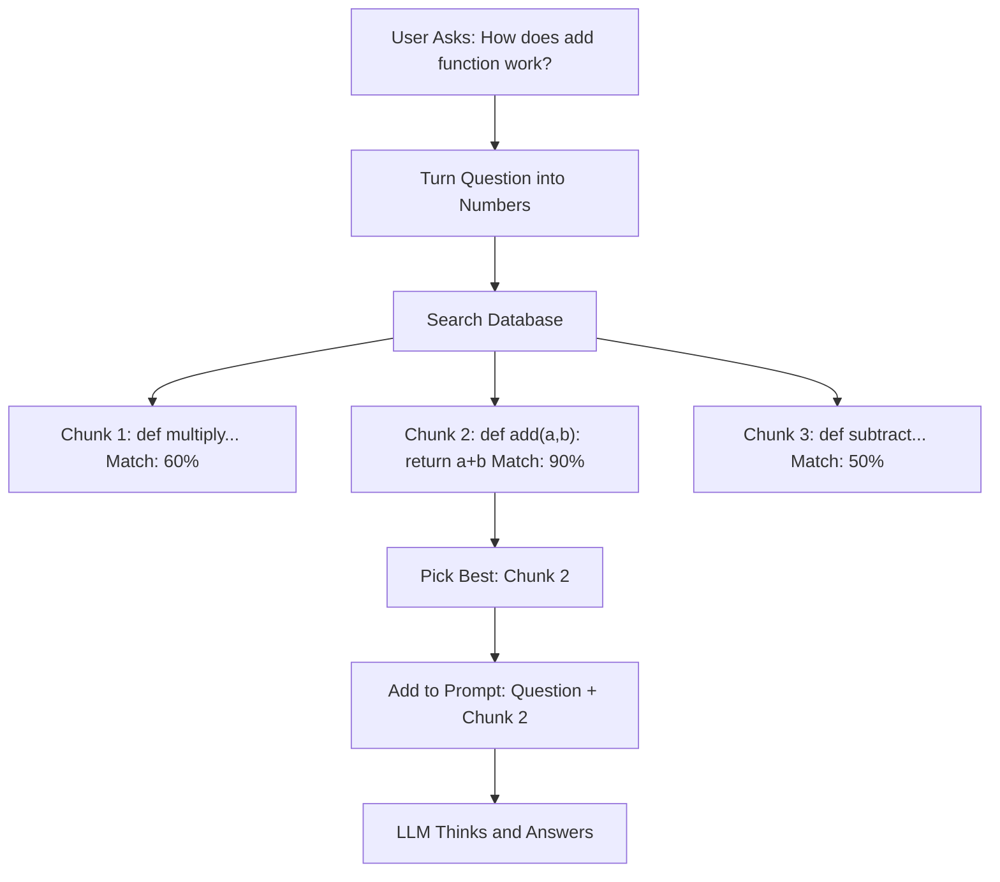

# Module 3: Retrieval-Augmented Generation (RAG) and Vector Embeddings

Hello again! Modules 1 and 2 taught us about LLMs and how fine-tuning specializes them. Now, imagine giving your LLM a "super brain" that remembers your code. That's RAG! It helps LLMs answer questions about specific things, like your projects. Let's learn it step by step with fun visuals.

## I. Why We Need RAG

### A. The Context Window Limit

LLMs have a "memory limit" called the context window. They can't read your whole codebase at once or know private details. Without RAG, LLMs might guess wrong or make up info.

### B. What is RAG?

RAG stands for Retrieval-Augmented Generation. It helps with context window limits by pulling in relevant info from your data before generating answers.

**How it works**: Convert text to vector embeddings (numbers) using encoder models. Store in vector DBs like ChromaDB, Milvus, Weaviate, Pinecone, FAISS. Query by converting your question to vectors, find similar ones (cosine similarity), get top results to LLM.

**Why cool?** RAG stops wrong answers and lets LLMs use real code facts.

ASCII Art:
```
Question: "What does function X do?"
Find: [Look in Code] -> [Get Function X]
Add: Question + Function X = Better Question
Answer: LLM says the truth!
```

## II. Vector Embeddings: The Magic Numbers

### A. What Are Embeddings?

Embeddings are lists of numbers that "describe" text or code. Think of them as a code's "fingerprint." A special model (encoder) turns words into these numbers.

### B. How They Help

Similar code gets similar numbers. Like neighbors in a city—close addresses mean similar places.

We check how close two fingerprints are using "cosine similarity." High score = very similar!

**Vector Generation**: Encoder models create these vectors.

Example:
```
Code 1: "def add(a, b): return a + b" -> Numbers: [0.1, 0.8, ...]
Code 2: "def sum(x, y): return x + y" -> Numbers: [0.1, 0.7, ...]
Close numbers = Similar code!
```

## III. Storing Embeddings: Vector Databases

### A. What They Do

Vector DBs are special storages for millions of fingerprints. They keep the numbers and link them to the original code.

They search super fast using smart math.

**Querying**: Convert query to vector, search DB for top-N similar (cosine similarity), return to LLM.

### B. Popular Ones

**Free and Local**:
- ChromaDB: Easy for beginners.
- Milvus: For bigger projects.
- FAISS: Quick searches in memory.

**Online Services**:
- Pinecone: Simple and managed.
- Weaviate: Good for organizing data.

## IV. The RAG Process: Step by Step

### A. Setup (Indexing)

1. Load your code files.
2. Break into small chunks (like sentences or functions).
3. Turn chunks into fingerprints (embeddings).
4. Store in a Vector DB.

### B. Answering Questions (Querying)

1. Get user's question.
2. Turn question into a fingerprint.
3. Search DB for the closest fingerprints (top matches).
4. Grab the real code from those matches.
5. Add code to the question for LLM.
6. LLM answers using the extra info.

## V. Tools and Real Uses

### A. Easy RAG Tools

- **Haystack** ([haystack.deepset.ai](https://haystack.deepset.ai/)): Build RAG systems with ready parts.
- **LlamaIndex** ([llamaindex.ai](https://www.llamaindex.ai/)): Connect LLMs to your data easily.

**Simple Examples**:

For ChromaDB ([github.com/chroma-core/chroma](https://github.com/chroma-core/chroma)):
```python
import chromadb
client = chromadb.Client()
collection = client.create_collection("code_chunks")

# Add some code snippets with embeddings (assume embeddings are pre-computed)
documents = ["def add(a, b): return a + b", "def multiply(x, y): return x * y"]
ids = ["func1", "func2"]
embeddings = [[0.1, 0.2, ...], [0.3, 0.4, ...]]  # Example vectors

collection.add(
    documents=documents,
    embeddings=embeddings,
    ids=ids
)

# Query for similar code
query_embedding = [0.1, 0.2, ...]  # Vector for "add function"
results = collection.query(
    query_embeddings=[query_embedding],
    n_results=1
)
print(results['documents'])  # Gets the most similar code
```

For Haystack ([haystack.deepset.ai](https://haystack.deepset.ai/)):
```python
from haystack import Pipeline
from haystack.components.builders import PromptBuilder
from haystack.components.generators import OpenAIGenerator

# Simple pipeline: Retrieve and generate
pipeline = Pipeline()
pipeline.add_component("retriever", InMemoryBM25Retriever(document_store=doc_store))
pipeline.add_component("prompt_builder", PromptBuilder(template="Answer: {{documents}} {{query}}"))
pipeline.add_component("generator", OpenAIGenerator())

pipeline.connect("retriever", "prompt_builder")
pipeline.connect("prompt_builder", "generator")

# Run query
result = pipeline.run({"retriever": {"query": "How does add work?"}})
```

For LlamaIndex ([llamaindex.ai](https://www.llamaindex.ai/)):
```python
from llama_index import VectorStoreIndex, SimpleDirectoryReader

# Load documents from folder
documents = SimpleDirectoryReader("data").load_data()
index = VectorStoreIndex.from_documents(documents)

# Create query engine
query_engine = index.as_query_engine()

# Ask a question
response = query_engine.query("What is the add function?")
print(response)
```

For FAISS ([github.com/facebookresearch/faiss](https://github.com/facebookresearch/faiss)):
```python
import faiss
import numpy as np
# Create index
index = faiss.IndexFlatL2(128)  # 128-dim vectors
# Add vectors
vectors = np.random.random((100, 128)).astype('float32')
index.add(vectors)
# Search
query = np.random.random((1, 128)).astype('float32')
distances, indices = index.search(query, 5)
```

### B. For Your Projects

- Tutorial Maker: Find code parts to explain.
- Chatbot: Get exact code for questions.

**Usages and Use Cases**: RAG is great for Q&A on codebases, docs, or any large data. Libraries like Haystack and LlamaIndex have ready-to-use RAG with examples.

## Mermaid Diagram: RAG in Action

See how RAG picks the best code chunk:



## Tutorial Progress


## Summary

RAG boosts LLMs with your code knowledge. You now know embeddings, DBs, and the steps. Try ChromaDB for practice!

**Quick Check**: Name the 3 RAG steps. Why are embeddings useful?

Keep going! 🚀

**Previous Module:** [Module 2: Training LLMs](2_training.md)
**Next Module:** [Module 4: LLM Tool Calling](4_tools.md)
