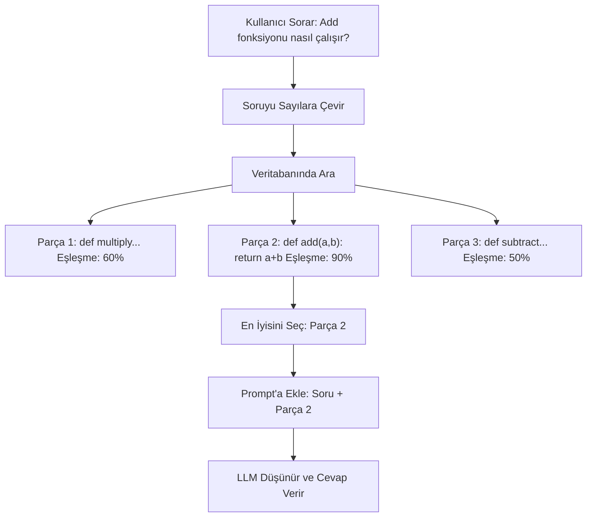

# Module 3: Retrieval-Augmented Generation (RAG) ve Vector Embeddings

Tekrar merhaba! Modül 1 ve 2'de LLM'lerin temellerini ve fine-tuning ile nasıl özelleştirildiklerini öğrendik. Şimdi, LLM'ine kodunu hatırlayan bir "süper beyin" verdiğini hayal et. İşte RAG bu! LLM'lerin projelerin gibi spesifik şeyler hakkında soru cevaplamasına yardımcı olur. Eğlenceli görsellerle adım adım öğrenelim.

## I. Neden RAG'a İhtiyacımız Var?

### A. Context Window Sınırlaması

LLM'lerin "hafıza limiti" var, buna context window denir. Tüm kod tabanını bir seferde okuyamaz veya özel detayları bilemez. RAG olmadan, LLM'ler yanlış tahmin edebilir veya bilgi uydurabilir.

### B. RAG Nedir?

RAG, Retrieval-Augmented Generation'ın kısaltması. Context window sınırlarını aşmak için verilerinden ilgili bilgileri çekerek LLM'lere yardımcı olur.

**Nasıl çalışır**: Metni vector embeddings'e (sayılara) çevirmek için encoder modeller kullan. ChromaDB, Milvus, Weaviate, Pinecone, FAISS gibi vector DB'lerde sakla. Sorunu vektörlere çevir, benzer olanları (cosine similarity) bul, en iyi sonuçları LLM'ye ver.

**Neden harika?** Yanlış cevapları durdurur ve LLM'lerin gerçek kod gerçeklerini kullanmasını sağlar.

ASCII Art:
```
Soru: "X fonksiyonu ne yapıyor?"
Bul: [Kodda Bak] -> [X Fonksiyonunu Al]
Ekle: Soru + X Fonksiyonu = Daha İyi Soru
Cevap: LLM gerçeği söyler!
```

## II. Vector Embeddings: Sihirli Sayılar

### A. Embeddings Nedir?

Embeddings, metin veya kodu "tanımlayan" sayı listeleri. Kodun "parmak izi" gibi düşün. Özel bir model (encoder) kelimeleri bu sayılara çevirir.

### B. Nasıl Yardımcı Olur?

Benzer kod benzer sayılara sahip olur. Şehirdeki komşular gibi—yakın adresler benzer yerler demek.

İki parmak izinin ne kadar yakın olduğunu "cosine similarity" ile kontrol ederiz. Yüksek puan = çok benzer!

**Vector Üretimi**: Encoder modeller bu vektörleri oluşturur.

Örnek:
```
Kod 1: "def add(a, b): return a + b" -> Sayılar: [0.1, 0.8, ...]
Kod 2: "def sum(x, y): return x + y" -> Sayılar: [0.1, 0.7, ...]
Yakın sayılar = Benzer kod!
```

## III. Embeddings Saklama: Vector Veritabanları

### A. Ne Yaparlar?

Vector DB'ler milyonlarca parmak izi için özel depolardır. Sayıları saklar ve orijinal koda bağlar.

Akıllı matematikle süper hızlı arama yaparlar.

**Sorgulama**: Sorguyu vektöre çevir, DB'de en benzer olanları (cosine similarity) ara, LLM'ye döndür.

### B. Popüler Olanlar

**Ücretsiz ve Yerel**:
- ChromaDB: Başlangıç seviyesindekiler için kolay.
- Milvus: Daha büyük projeler için.
- FAISS: Hafızada hızlı aramalar.

**Çevrimiçi Servisler**:
- Pinecone: Basit ve yönetilen.
- Weaviate: Veri organize etmek için iyi.

## IV. RAG Süreci: Adım Adım

### A. Kurulum (Indexing)

1. Kod dosyalarını yükle.
2. Küçük parçalara böl (cümleler veya fonksiyonlar gibi).
3. Parçaları parmak izlerine (embeddings) çevir.
4. Vector DB'de sakla.

### B. Soru Cevaplama (Querying)

1. Kullanıcının sorusunu al.
2. Soruyu parmak izine çevir.
3. DB'de en yakın parmak izlerini ara (en iyi eşleşmeler).
4. O eşleşmelerden gerçek kodu al.
5. Kodu soruya ekle LLM için.
6. LLM ekstra bilgiyle cevap verir.

## V. Araçlar ve Gerçek Kullanımlar

### A. Kolay RAG Araçları

- **Haystack** ([haystack.deepset.ai](https://haystack.deepset.ai/)): Hazır parçalarla RAG sistemleri inşa et.
- **LlamaIndex** ([llamaindex.ai](https://www.llamaindex.ai/)): LLM'leri verilerine kolay bağla.

**Basit Örnekler**:

ChromaDB için ([github.com/chroma-core/chroma](https://github.com/chroma-core/chroma)):
```python
import chromadb
client = chromadb.Client()
collection = client.create_collection("code_chunks")

# Bazı kod parçalarını embeddings ile ekle (embeddings önceden hesaplanmış varsay)
documents = ["def add(a, b): return a + b", "def multiply(x, y): return x * y"]
ids = ["func1", "func2"]
embeddings = [[0.1, 0.2, ...], [0.3, 0.4, ...]]  # Örnek vektörler

collection.add(
    documents=documents,
    embeddings=embeddings,
    ids=ids
)

# Benzer kod için sorgula
query_embedding = [0.1, 0.2, ...]  # "add function" için vektör
results = collection.query(
    query_embeddings=[query_embedding],
    n_results=1
)
print(results['documents'])  # En benzer kodu alır
```

Haystack için ([haystack.deepset.ai](https://haystack.deepset.ai/)):
```python
from haystack import Pipeline
from haystack.components.builders import PromptBuilder
from haystack.components.generators import OpenAIGenerator

# Basit pipeline: Al ve üret
pipeline = Pipeline()
pipeline.add_component("retriever", InMemoryBM25Retriever(document_store=doc_store))
pipeline.add_component("prompt_builder", PromptBuilder(template="Cevap: {{documents}} {{query}}"))
pipeline.add_component("generator", OpenAIGenerator())

pipeline.connect("retriever", "prompt_builder")
pipeline.connect("prompt_builder", "generator")

# Sorguyu çalıştır
result = pipeline.run({"retriever": {"query": "Add nasıl çalışır?"}})
```

LlamaIndex için ([llamaindex.ai](https://www.llamaindex.ai/)):
```python
from llama_index import VectorStoreIndex, SimpleDirectoryReader

# Klasörden belgeleri yükle
documents = SimpleDirectoryReader("data").load_data()
index = VectorStoreIndex.from_documents(documents)

# Sorgu motoru oluştur
query_engine = index.as_query_engine()

# Soru sor
response = query_engine.query("Add fonksiyonu nedir?")
print(response)
```

FAISS için ([github.com/facebookresearch/faiss](https://github.com/facebookresearch/faiss)):
```python
import faiss
import numpy as np
# İndeks oluştur
index = faiss.IndexFlatL2(128)  # 128-boyutlu vektörler
# Vektörleri ekle
vectors = np.random.random((100, 128)).astype('float32')
index.add(vectors)
# Ara
query = np.random.random((1, 128)).astype('float32')
distances, indices = index.search(query, 5)
```

### B. Projelerin İçin

- Tutorial Yapıcı: Açıklamak için kod parçaları bul.
- Chatbot: Sorular için tam kodu al.

**Kullanımlar ve Kullanım Alanları**: RAG, kod tabanları, dokümanlar veya büyük veriler üzerinde Q&A için harika. Haystack ve LlamaIndex gibi kütüphaneler örneklerle hazır RAG sunar.

## Mermaid Diyagramı: RAG İş Başında

RAG'nin en iyi kod parçasını nasıl seçtiğini gör:



## Eğitim İlerlemesi

Seride neredeyiz:


## Özet

RAG, LLM'leri kod bilginle güçlendirir. Embeddings, DB'ler ve adımları biliyorsun. ChromaDB ile pratik yap!

**Hızlı Kontrol**: 3 RAG adımını söyle. Embeddings neden faydalı?

Devam et! 🚀

**Önceki Modül:** [Modül 2: Training LLMs](2_training_tr.md)
**Sonraki Modül:** [Modül 4: LLM Tool Calling](4_tools_tr.md)
