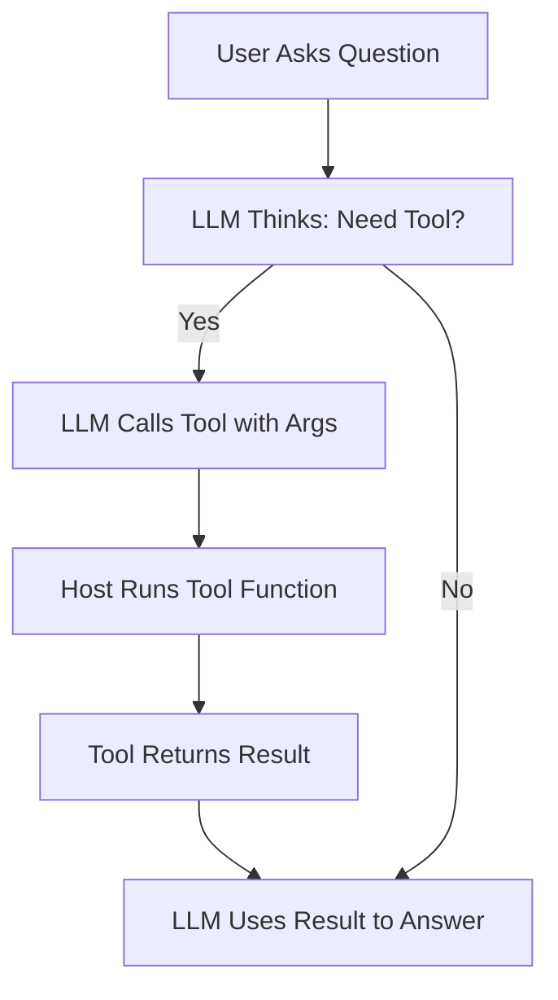
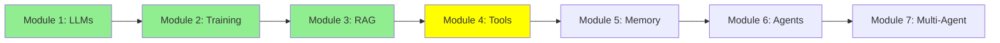

# Module 4: LLM Tool Calling

Hi! Modules 1, 2, and 3 covered LLMs, fine-tuning, and RAG. Now, let's make LLMs do real actions, like reading files or running commands. This is "tool calling"—giving LLMs superpowers to interact with the world. Let's explore in more detail!

## I. What is an LLM Tool?

A **tool** is just a function that you write in code. It's a normal Python function with a name, inputs, and outputs. The LLM doesn't run it directly—instead, based on what the user asks, the LLM decides if it needs to call one of your tools and provides the right inputs.

For example, you define a tool like `read_file(filename)`. The LLM sees the tool's description and, if the user says "Read the main.py file," the LLM calls it with `filename="main.py"`.

ASCII Art:
```
Tool Definition: def read_file(filename): ...
User: "Read main.py"
LLM: "Call read_file with 'main.py'"
Tool Runs: Returns file content
LLM: "File says: ..."
```

## II. Why Tool Calling is Important and Useful

### A. LLM Limitations

LLMs are trained on fixed data, so their knowledge is limited. They can't get live info or interact with the world.

### B. Expanding Capabilities

Tools fix this! They let LLMs access real-time info or perform actions.

**Example 1: Web Search**
LLMs can't search the internet. But you can write a tool (a function) that accepts a query and runs it in web search engines (like Google). This way, the LLM can access the internet.

**Example 2: Code Access**
LLMs can't read your local files. But with a tool that takes a filename and returns the content, the LLM can "see" your code.

Tools make LLMs active helpers, not just passive chatbots.

## III. Use Cases and Examples of Tools

Tools can do many things based on needs. Numerous tools can be used for LLMs, such as:

*(Notice the `@tool` decorator above each function below. In most agent frameworks — like smolagents, which we'll use in the next module — that single decorator is all it takes to register a plain function as a tool the LLM can call. No extra registration step needed.)*

- **Sending Emails**:
  ```python
  import smtplib
  @tool
  def send_email(to, subject, body):
      # SMTP setup
      server = smtplib.SMTP('smtp.example.com')
      server.sendmail('from@example.com', to, f'Subject: {subject}\n\n{body}')
      server.quit()
  ```

- **Terminal Access**:
  ```python
  import subprocess
  @tool
  def run_command(command):
      result = subprocess.run(command, shell=True, capture_output=True, text=True)
      return result.stdout
  ```

- **Getting Time**:
  ```python
  import datetime
  @tool
  def get_current_time():
      return datetime.datetime.now().strftime('%Y-%m-%d %H:%M:%S')
  ```

- **Database Queries**:
  ```python
  import sqlite3
  @tool
  def query_db(sql):
      conn = sqlite3.connect('database.db')
      cursor = conn.cursor()
      cursor.execute(sql)
      results = cursor.fetchall()
      conn.close()
      return results
  ```

- **Vector DB Queries**:
  ```python
  @tool
  def query_vector_db(query):
      # Similar to RAG
      embedding = encode(query)
      results = vector_db.search(embedding, top_k=5)
      return results
  ```

For your projects, tools like read_file, run_shell, and query_vector_db are key for code tasks.

## IV. Why Tools Matter for Projects

Tools turn LLMs into smart assistants that:
- Handle complex tasks step by step.
- Access files, run code, search web.
- Make projects interactive and powerful.

Without tools, LLMs are just chatbots. With tools, they're agents!

## Mermaid Diagram: Tool Calling Flow



## Tutorial Progress



## Summary

Tools let LLMs act in the real world. You learned what they are, why they're useful, and examples. Next, agents combine everything!

**Quick Check**: Why do LLMs need tools?

Keep learning! 🚀

**Previous Module:** [Module 3: Retrieval-Augmented Generation (RAG)](3_rag.md)
**Next Module:** [Module 5: Memory](5_memory.md)
