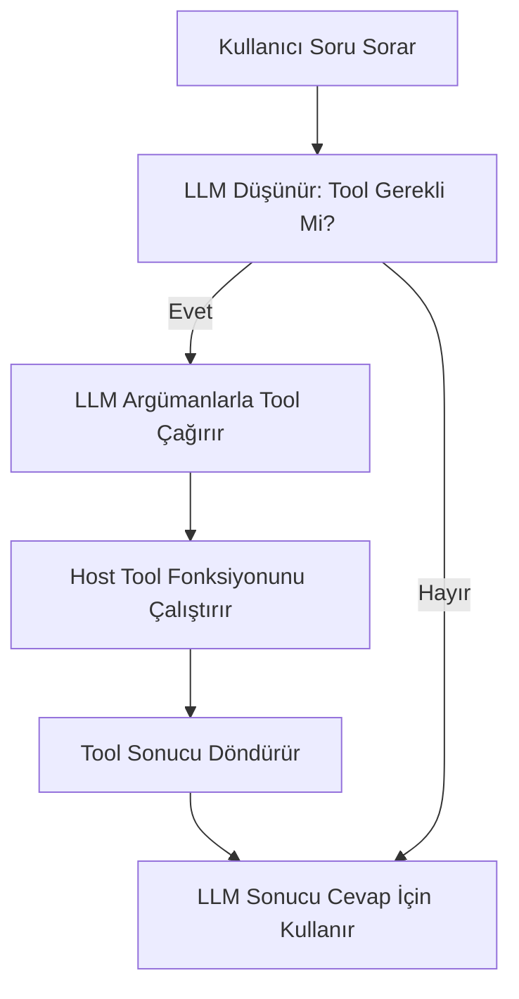
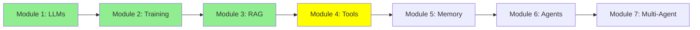

# Module 4: LLM Tool Calling

Merhaba! Modüller 1, 2 ve 3'te LLM'ler, fine-tuning ve RAG'ı öğrendik. Şimdi, LLM'leri dosya okumak veya komut çalıştırmak gibi gerçek eylemler yapması için yapalım. Bu "tool calling"—LLM'lere dünya ile etkileşim kurma süper gücü vermek. Daha detaylı keşfedelim!

## I. LLM Tool Nedir?

Bir **tool**, kodda yazdığın bir fonksiyon. Normal bir Python fonksiyonu, isim, girişler ve çıkışlar var. LLM onu doğrudan çalıştırmaz—kullanıcının ne dediğine göre, LLM hangi tool'u çağırması gerektiğini karar verir ve doğru girişleri sağlar.

Örneğin, `read_file(filename)` gibi bir tool tanımlarsın. LLM tool'un açıklamasını görür ve kullanıcı "main.py dosyasını oku" derse, LLM onu `filename="main.py"` ile çağırır.

ASCII Art:
```
Tool Tanımı: def read_file(filename): ...
Kullanıcı: "main.py'yi oku"
LLM: "'main.py' ile read_file çağır"
Tool Çalışır: Dosya içeriğini döndürür
LLM: "Dosya diyor ki: ..."
```

## II. Tool Calling Neden Önemli ve Faydalı?

### A. LLM Sınırlamaları

LLM'ler sabit veriler üzerinde eğitilir, yani bilgileri sınırlı. Canlı bilgi alamaz veya dünya ile etkileşim kuramaz.

### B. Yetenekleri Genişletme

Tool'lar bunu düzeltir! LLM'lere gerçek zamanlı bilgi erişimi veya eylemler yapma izni verirler.

**Örnek 1: Web Arama**
LLM'ler interneti arayamaz. Ama bir sorgu alan ve web arama motorlarında (Google gibi) çalıştıran bir tool yazabilirsin. Böylece LLM internete erişebilir.

**Örnek 2: Kod Erişimi**
LLM'ler yerel dosyalarını okuyamaz. Ama bir dosya adı alan ve içeriği döndüren tool ile, LLM kodunu "görebilir".

Tool'lar LLM'leri aktif yardımcılar yapar, pasif chatbot'lar değil.

## III. Kullanım Alanları ve Tool Örnekleri

Tool'lar ihtiyaçlara göre birçok şey yapabilir. LLM'ler için birçok tool kullanılabilir, örneğin:

*(Aşağıdaki her fonksiyonun üstündeki `@tool` decorator'ına dikkat et. Çoğu agent framework'ünde — bir sonraki modülde kullanacağımız smolagents gibi — bir fonksiyonu LLM'nin çağırabileceği bir tool'a dönüştürmek için tek gereken bu decorator. Ekstra bir kayıt adımına gerek yok.)*

- **E-posta Gönderme**:
  ```python
  import smtplib
  @tool
  def send_email(to, subject, body):
      # SMTP kurulumu
      server = smtplib.SMTP('smtp.example.com')
      server.sendmail('from@example.com', to, f'Subject: {subject}\n\n{body}')
      server.quit()
  ```

- **Terminal Erişimi**:
  ```python
  import subprocess
  @tool
  def run_command(command):
      result = subprocess.run(command, shell=True, capture_output=True, text=True)
      return result.stdout
  ```

- **Zaman Alma**:
  ```python
  import datetime
  @tool
  def get_current_time():
      return datetime.datetime.now().strftime('%Y-%m-%d %H:%M:%S')
  ```

- **Veritabanı Sorguları**:
  ```python
  import sqlite3
  @tool
  def query_db(sql):
      conn = sqlite3.connect('database.db')
      cursor = conn.cursor()
      cursor.execute(sql)
      results = cursor.fetchall()
      conn.close()
      return results
  ```

- **Vector DB Sorguları**:
  ```python
  @tool
  def query_vector_db(query):
      # RAG gibi
      embedding = encode(query)
      results = vector_db.search(embedding, top_k=5)
      return results
  ```

Projelerin için read_file, run_shell ve query_vector_db gibi tool'lar kod görevleri için anahtar.

## IV. Projeler İçin Tool'lar Neden Önemli?

Tool'lar LLM'leri akıllı asistanlara dönüştürür ki:
- Karmaşık görevleri adım adım halleder.
- Dosyalara erişir, kod çalıştırır, web arar.
- Projeleri etkileşimli ve güçlü yapar.

Tool olmadan LLM'ler sadece chatbot'lar. Tool ile agent'lar!

## Mermaid Diyagramı: Tool Calling Akışı



## Eğitim İlerlemesi



## Özet

Tool'lar LLM'lerin gerçek dünyada eylem yapmasını sağlar. Ne olduklarını, neden faydalı olduklarını ve örnekleri öğrendin. Sonra agent'lar her şeyi birleştirir!

**Hızlı Kontrol**: LLM'ler neden tool'lara ihtiyaç duyar?

Öğrenmeye devam et! 🚀

**Önceki Modül:** [Modül 3: Retrieval-Augmented Generation (RAG)](3_rag_tr.md)
**Sonraki Modül:** [Modül 5: Memory](5_memory_tr.md)
