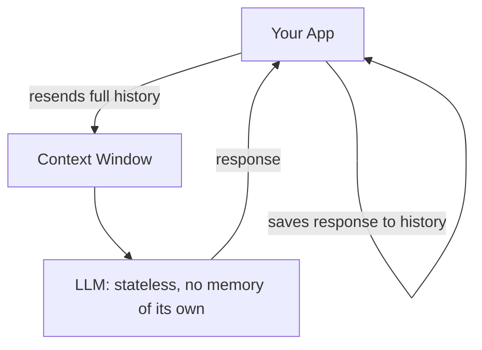
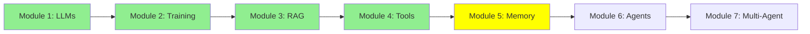

# Module 5: Memory (Short-Term Memory & Context)

Hi again! We've covered LLMs, training, RAG, and tools. Before we get to agents, there's one idea that quietly underlies everything we've done so far: LLMs don't actually remember anything. Let's fix that misconception.

## I. LLMs Are Stateless

An LLM is **stateless** — the moment it finishes generating a response, it forgets everything. There is no hidden memory inside the model between calls. Every single call starts completely fresh.

So how does a chatbot seem to "remember" what you said three messages ago? It doesn't, really — the app around the model resends the *entire* conversation history back into the model's context window on every call. That resent history is the model's memory, and because it only exists for the duration of one call's context window, it's called **short-term memory**.

ASCII Art:
```
Call 1: [System Prompt + "Hi, I'm Aylin"] --> LLM --> "Hello Aylin!"
Call 2: [System Prompt + "Hi, I'm Aylin" + "Hello Aylin!" + "What's my name?"] --> LLM --> "Your name is Aylin."
```

Notice Call 2 resends everything from Call 1, plus the new message. The LLM itself remembers nothing — the app is doing all the remembering, by stuffing the past back into the context every single time.

## II. Short-Term Memory vs. Long-Term Memory

- **Short-term memory** = the context window. Fast and free, but limited in size (Module 1's context window limit) and it disappears the moment the conversation ends — unless something outside the model saved it.
- **Long-term memory** = memory that survives across sessions, usually stored outside the model entirely (a database, a vector store, a file on disk). RAG (Module 3) is one way to bring long-term knowledge back into context. We'll go much deeper on dedicated long-term memory systems later, in Expert Module 4: Advanced Memory.

The takeaway for now: **the LLM has no memory of its own. The context window is memory borrowed for a single call, and it's your application's job to keep refilling it.**

## Mermaid Diagram: Where "Memory" Actually Lives



## Tutorial Progress



## Summary

LLMs are stateless — every call starts from zero. What looks like "memory" is really the app resending conversation history into the context window every time, which is why we call it short-term memory. True long-term memory needs something outside the model. Next up: agents, which lean on this same context window to plan and act across many steps.

**Quick Check**: Why are LLMs called "stateless"? What's the difference between short-term memory and long-term memory?

Keep going! 🚀

**Previous Module:** [Module 4: LLM Tool Calling](4_tools.md)
**Next Module:** [Module 6: AI Agents: From Single Call to Multi-Step Reasoning](6_agents.md)
