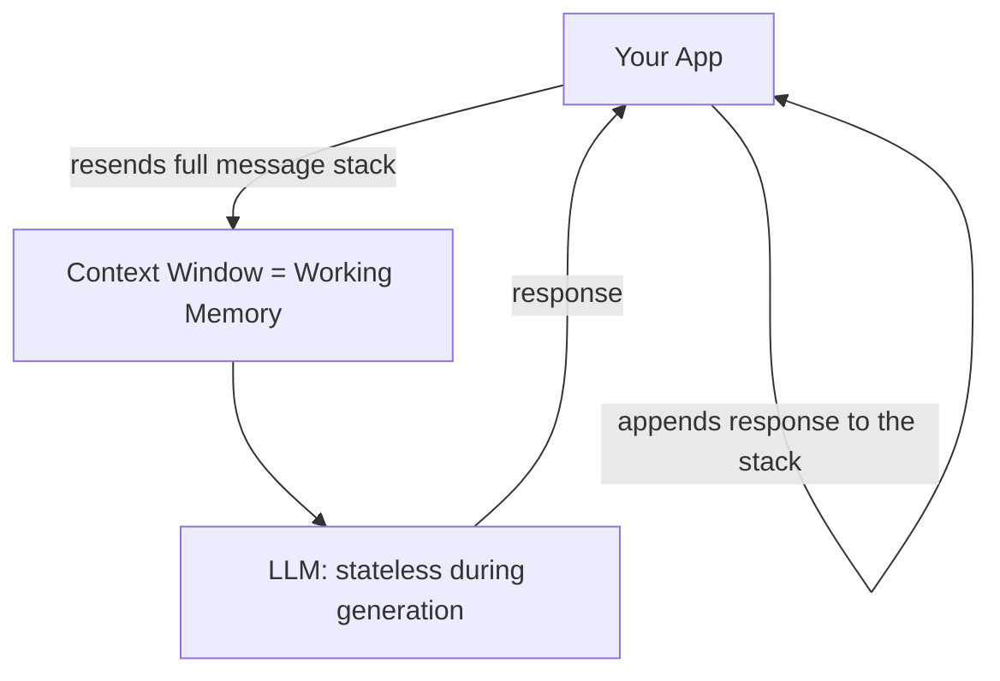
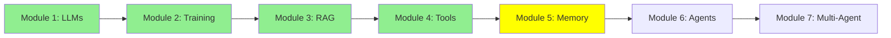

# Module 5: Memory — Parametric, Working (Short-Term), and Long-Term

Hi again! We've covered LLMs, training, RAG, and tools. Before we get to agents, there's one idea that quietly underlies everything we've done so far: LLMs don't actually remember anything on their own. There isn't just one kind of "memory" either — there are three, and they behave very differently. Let's break them down.

## I. Three Types of Memory

- **Parametric memory** (offline / permanent) — knowledge baked into the model's weights during training or fine-tuning.
- **Short-term memory**, a.k.a. **working memory** (online / temporary) — whatever is currently sitting inside the LLM's context window, right now.
- **Long-term memory** (online / temporary) — a summary or index of past conversations/documents, stored outside the model, that gets retrieved back into working memory when needed.

Let's go through each one.

## II. Parametric Memory: What's Baked Into the Weights

Remember Module 2, where we trained and fine-tuned models? When you fine-tune a model on, say, a pile of legal documents, that information gets stored permanently inside the model's weights (its parameters).

- **Permanent**: it doesn't disappear when the session ends, and you don't need to resend it every call — it's just *in* the model.
- **Imprecise at scale**: the problem is that a model's weights hold an enormous amount of information — billions of documents' worth. Cramming your specific document in among all of that makes it hard for the model to memorize and retrieve it *exactly*.

Think of it like a person who has read 1,000 books. They generally know what those books were about, but ask them to quote page 214 of book #537 word-for-word, and they'll struggle — the information is in there somewhere, just not precisely retrievable.

## III. Short-Term Memory (a.k.a. Working Memory): What's In Context Right Now

It's worth calling this memory what it really is: **working memory**. It's the memory the LLM is actively "working with" at this exact moment — literally whatever text is sitting inside its context window right now.

Compare it to the person-with-1000-books analogy: working memory is like that same person, except now they have *one specific book open right in front of their eyes*. They don't need to recall anything from a hazy memory of everything they've ever read — they can just read it directly. That's why LLMs perform so much better with working memory than with parametric memory: the information isn't buried among billions of other documents, it's right there in front of them.

**The catch**: working memory is limited in size (e.g. 200K or 1M tokens) and it can fill up. And the moment you start a new session — opening a new Claude Code or ChatGPT conversation — it's gone. Every new session starts with a completely empty context window, because the LLM keeps no state of its own between sessions.

### LLMs Are Stateless During Generation

Important distinction: LLMs are stateless **during generation** (this is different from training, which is a one-time process that produces parametric memory). During generation — i.e. every time it's actually replying to you — the model saves nothing on its own. Every single message you send is, technically, a brand new, independent call to the LLM, as if it were a new session, because the LLM itself keeps no state of the conversation.

So how does it feel like a continuous conversation? Because *we* fake it. We keep a growing stack of every message exchanged so far, and every time something new happens — you send a message, or the LLM generates a reply — we append it to that stack, and then send the **entire stack** back to the LLM on the next call.

ASCII Art:
```
Stack: []
You: "Hi, I'm Aylin"                 -->  append  -->  Stack: [Human: "Hi, I'm Aylin"]
                                                        send WHOLE stack to LLM
LLM generates: "Hello Aylin!"        -->  append  -->  Stack: [Human: "Hi, I'm Aylin", AI: "Hello Aylin!"]

You: "What's my name?"               -->  append  -->  Stack: [..., Human: "What's my name?"]
                                                        send WHOLE stack to LLM
LLM generates: "Your name is Aylin." -->  append  -->  Stack: [..., AI: "Your name is Aylin."]
```

Notice that every call sends the *whole* stack, not just the newest message — because the LLM remembers nothing from the previous call on its own. "Memory" here is really just us re-showing it everything, every single time.


*Short-term (working) memory is just this growing stack of Human/AI messages. Long-term memory is a separate store that this stack gets saved into (and retrieved from) across sessions. (The labels "Checkpointer" and "Store" here come from the LangGraph framework — different frameworks use different names for the same idea.)*

## IV. Long-Term Memory: Remembering Across Sessions

We'll go much deeper on this later, in the Expert track's Advanced Memory module — but here's the basic idea for now.

Sometimes, instead of just letting working memory disappear when a session ends, we save a summary or an index of it somewhere outside the model. Later, in a completely different session, that saved information can be pulled back into working memory when it's actually needed — often using RAG (Module 3).

**Example**: say you upload 5 PDFs to ChatGPT in one session, then start a brand-new session later and ask a question about those PDFs. ChatGPT may still be able to answer — not because the model "remembers" them in its weights (parametric memory), and not because they're sitting in the new session's empty context window (working memory) — but because it automatically indexed those PDFs during the earlier session, and can retrieve the relevant parts back into context now that you're asking about them again.

## V. Putting It All Together

| | Parametric | Working (Short-Term) | Long-Term |
|---|---|---|---|
| Stored in | Model weights | Context window | External storage (DB, vector store, files) |
| Persistence | Permanent | Temporary — gone when the session ends or context fills up | Persists across sessions |
| Precision | Fuzzy — hard to recall exactly among billions of documents | Very precise — the LLM reads it directly | Precise once retrieved back into context |
| Created by | Training / fine-tuning (Module 2) | A growing stack of messages | Explicit save + retrieval, often via RAG (Module 3) |
| Analogy | Someone who's read 1,000 books | Someone reading a book open right in front of them | Someone's own notes, looked up later |

The takeaway: **the LLM itself has no memory of its own — parametric memory is what training baked into its weights, working memory is what your app is currently showing it, and long-term memory is what your app saves and brings back later.**

## Mermaid Diagram: Where Working Memory Actually Lives



## Tutorial Progress



## Summary

There are three kinds of memory, and they're not interchangeable: **parametric memory** (permanent, but fuzzy at scale, baked in by training), **working memory** (precise but temporary — just a growing stack of messages re-sent every call), and **long-term memory** (saved outside the model and retrieved back into working memory when needed, often via RAG). Next up: agents, which lean on this same working memory to plan and act across many steps.

**Quick Check**: What are the three types of memory? Why is parametric memory imprecise even though it's permanent? Why do we call short-term memory "working memory"? How does information from long-term memory make it back into the LLM's context?

Keep going! 🚀

**Previous Module:** [Module 4: LLM Tool Calling](4_tools.md)
**Next Module:** [Module 6: AI Agents: From Single Call to Multi-Step Reasoning](6_agents.md)
