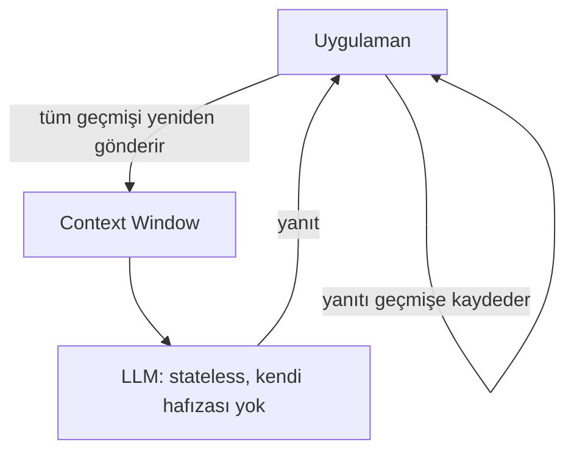
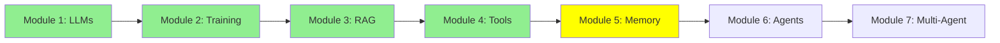

# Module 5: Memory (Kısa Süreli Hafıza ve Context)

Tekrar merhaba! LLM'leri, training'i, RAG'ı ve tool'ları öğrendik. Agent'lara geçmeden önce, şimdiye kadar yaptığımız her şeyin altında sessizce yatan bir fikir var: LLM'ler aslında hiçbir şeyi hatırlamıyor. Bu yanlış anlamayı düzeltelim.

## I. LLM'ler Stateless'tir

Bir LLM **stateless**'tir (durumsuzdur)—bir yanıt üretmeyi bitirdiği anda her şeyi unutur. Çağrılar arasında modelin içinde gizli bir hafıza yoktur. Her çağrı tamamen sıfırdan başlar.

O zaman bir chatbot üç mesaj önce söylediğini nasıl "hatırlıyor" görünüyor? Aslında hatırlamıyor—modelin etrafındaki uygulama, *tüm* konuşma geçmişini her çağrıda modelin context window'una yeniden gönderiyor. Bu yeniden gönderilen geçmiş, modelin hafızasıdır, ve sadece bir çağrının context window'u boyunca var olduğu için buna **kısa süreli hafıza** denir.

ASCII Art:
```
Çağrı 1: [System Prompt + "Merhaba, ben Aylin"] --> LLM --> "Merhaba Aylin!"
Çağrı 2: [System Prompt + "Merhaba, ben Aylin" + "Merhaba Aylin!" + "Adım ne?"] --> LLM --> "Adın Aylin."
```

Çağrı 2'nin, Çağrı 1'deki her şeyi, üstüne yeni mesajı da ekleyerek yeniden gönderdiğine dikkat et. LLM'in kendisi hiçbir şeyi hatırlamıyor—tüm hatırlama işini, geçmişi her seferinde context'e tekrar tıkıştıran uygulama yapıyor.

## II. Kısa Süreli Hafıza vs. Uzun Süreli Hafıza

- **Kısa süreli hafıza** = context window. Hızlı ve ücretsiz, ama boyutu sınırlı (Modül 1'deki context window sınırı) ve konuşma bittiği anda kaybolur—modelin dışında biri onu kaydetmediyse.
- **Uzun süreli hafıza** = oturumlar arasında hayatta kalan hafıza, genellikle modelin tamamen dışında saklanır (bir veritabanı, bir vector store, diskte bir dosya). RAG (Modül 3), uzun süreli bilgiyi context'e geri getirmenin bir yolu. Adanmış uzun süreli hafıza sistemlerine daha derinlemesine, ileride Expert Modül 4: Advanced Memory'de gireceğiz.

Şimdilik akılda kalması gereken şey: **LLM'in kendi hafızası yok. Context window, tek bir çağrı için ödünç alınmış bir hafıza, ve onu doldurmaya devam etmek senin uygulamanın işi.**

## Mermaid Diyagramı: "Hafıza" Gerçekte Nerede Yaşıyor



## Eğitim İlerlemesi



## Özet

LLM'ler stateless'tir—her çağrı sıfırdan başlar. "Hafıza" gibi görünen şey, uygulamanın her seferinde konuşma geçmişini context window'a yeniden göndermesidir, bu yüzden buna kısa süreli hafıza diyoruz. Gerçek uzun süreli hafıza, modelin dışında bir şeye ihtiyaç duyar. Sırada: bu aynı context window'a yaslanarak plan yapan ve birçok adımda eylemde bulunan agent'lar.

**Hızlı Kontrol**: LLM'lere neden "stateless" deniyor? Kısa süreli hafıza ile uzun süreli hafıza arasındaki fark ne?

Devam et! 🚀

**Önceki Modül:** [Modül 4: LLM Tool Calling](4_tools_tr.md)
**Sonraki Modül:** [Modül 6: AI Agents: Tek Çağrıdan Çok Adımlı Akıl Yürütmeye](6_agents_tr.md)
