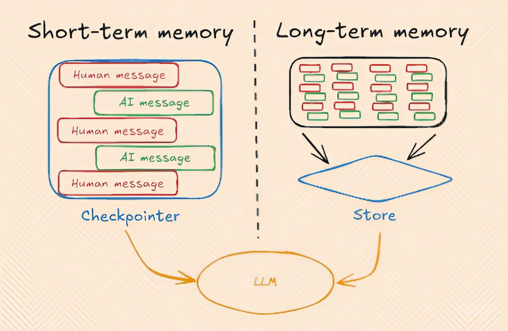
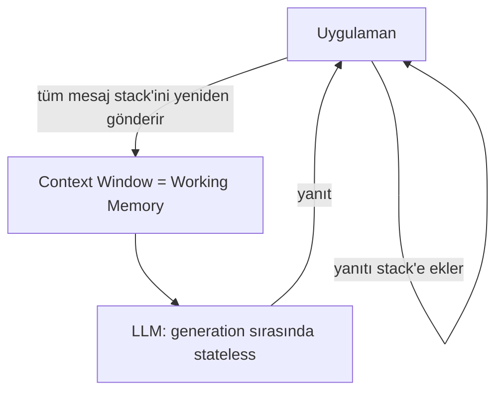
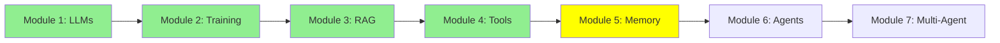

# Module 5: Memory — Parametric, Working (Short-Term) ve Long-Term

Tekrar merhaba! LLM'leri, training'i, RAG'ı ve tool'ları öğrendik. Agent'lara geçmeden önce, şimdiye kadar yaptığımız her şeyin altında sessizce yatan bir fikir var: LLM'ler kendi başlarına hiçbir şeyi hatırlamıyor. Ayrıca tek bir "hafıza" türü de yok—üç tür var, ve çok farklı davranıyorlar. Hadi tek tek inceleyelim.

## I. Üç Tür Hafıza

- **Parametric memory** (offline / kalıcı) — training veya fine-tuning sırasında modelin ağırlıklarına gömülen bilgi.
- **Short-term memory**, diğer adıyla **working memory** (online / geçici) — şu anda LLM'in context window'unun içinde oturan her şey.
- **Long-term memory** (online / geçici) — modelin dışında saklanan, geçmiş konuşmaların/dokümanların bir özeti veya indeksi, ve gerektiğinde working memory'ye geri getirilir.

Şimdi tek tek bakalım.

## II. Parametric Memory: Ağırlıklara Gömülü Olan

Modül 2'yi hatırla, modelleri train ve fine-tune ettiğimiz yer. Bir modeli, diyelim ki bir yığın hukuki doküman üzerinde fine-tune ettiğinde, o bilgi modelin ağırlıklarına (parametrelerine) kalıcı olarak kaydedilir.

- **Kalıcı**: oturum bittiğinde kaybolmaz, ve her çağrıda yeniden göndermene gerek yok—sadece modelin *içinde*.
- **Ölçekte hassas değil**: sorun şu ki modelin ağırlıkları devasa miktarda bilgi tutuyor—milyarlarca dokümanın karşılığı. Senin spesifik dokümanını bunların hepsinin arasına tıkıştırmak, modelin onu *tam olarak* ezberlemesini ve geri getirmesini zorlaştırıyor.

Bunu 1000 kitap okumuş bir insan gibi düşün. Genel olarak o kitapların ne hakkında olduğunu bilir, ama ondan 537. kitabın 214. sayfasını kelimesi kelimesine alıntılamasını istersen zorlanır—bilgi orada bir yerde, ama tam olarak geri getirilebilir değil.

## III. Short-Term Memory (diğer adıyla Working Memory): Şu Anda Context'te Olan

Bu hafızaya gerçekten ne olduğunu söylemek gerekirse: **working memory**. Bu, LLM'in şu anda aktif olarak "üzerinde çalıştığı" hafıza—yani şu anda context window'unun içinde oturan metin, tam olarak bu.

1000-kitap analojisine geri dönelim: working memory, aynı kişi ama şimdi *tam olarak gözlerinin önünde açık tek bir kitabı* var. Okuduğu her şeyin bulanık bir hafızasından bir şey hatırlamaya çalışmasına gerek yok—doğrudan okuyabilir. Bu yüzden LLM'ler working memory ile parametric memory'den çok daha iyi performans gösterir: bilgi milyarlarca başka dokümanın arasına gömülü değil, tam önlerinde.

**Sorun şu**: working memory boyut olarak sınırlı (örn. 200K veya 1M token) ve dolabilir. Ve yeni bir oturum başlattığın anda—yeni bir Claude Code veya ChatGPT konuşması açtığında—kaybolur. Her yeni oturum tamamen boş bir context window ile başlar, çünkü LLM'in kendisi oturumlar arasında hiçbir durum (state) tutmaz.

### LLM'ler Generation Sırasında Stateless'tir

Önemli bir ayrım: LLM'ler **generation sırasında** stateless'tir (bu, parametric memory'yi üreten tek seferlik bir süreç olan training'den farklı). Generation sırasında—yani sana her yanıt verdiğinde—model kendi başına hiçbir şey kaydetmez. Gönderdiğin her mesaj, teknik olarak, LLM'e yeni ve bağımsız bir çağrıdır, sanki yeni bir oturummuş gibi, çünkü LLM'in kendisi konuşmanın hiçbir durumunu tutmaz.

O zaman bu nasıl sürekli bir konuşma gibi hissettiriyor? Çünkü *biz* onu taklit ediyoruz. Şimdiye kadar değişilen her mesajın büyüyen bir stack'ini (yığınını) tutuyoruz, ve her yeni bir şey olduğunda—sen bir mesaj gönderdiğinde veya LLM bir yanıt ürettiğinde—onu bu stack'e ekliyoruz, ve sonra **tüm stack'i** bir sonraki çağrıda LLM'e geri gönderiyoruz.

ASCII Art:
```
Stack: []
Sen: "Merhaba, ben Aylin"              -->  ekle  -->  Stack: [Human: "Merhaba, ben Aylin"]
                                                        TÜM stack'i LLM'e gönder
LLM üretir: "Merhaba Aylin!"           -->  ekle  -->  Stack: [Human: "Merhaba, ben Aylin", AI: "Merhaba Aylin!"]

Sen: "Adım ne?"                        -->  ekle  -->  Stack: [..., Human: "Adım ne?"]
                                                        TÜM stack'i LLM'e gönder
LLM üretir: "Adın Aylin."              -->  ekle  -->  Stack: [..., AI: "Adın Aylin."]
```

Her çağrının sadece en yeni mesajı değil, *tüm* stack'i gönderdiğine dikkat et—çünkü LLM önceki çağrıdan kendi başına hiçbir şey hatırlamıyor. Buradaki "hafıza", aslında bizim ona her seferinde her şeyi yeniden göstermemizden ibaret.


*Short-term (working) memory, sadece bu büyüyen Human/AI mesaj stack'i. Long-term memory ise, bu stack'in oturumlar arasında kaydedildiği (ve geri getirildiği) ayrı bir store. ("Checkpointer" ve "Store" etiketleri burada LangGraph framework'ünden geliyor—farklı framework'ler aynı fikir için farklı isimler kullanır.)*

## IV. Long-Term Memory: Oturumlar Arasında Hatırlamak

Bunu daha derinlemesine, ileride Expert seviyesindeki Advanced Memory modülünde işleyeceğiz—ama şimdilik temel fikir şu.

Bazen, bir oturum bittiğinde working memory'nin sadece kaybolmasına izin vermek yerine, onun bir özetini veya indeksini modelin dışında bir yere kaydederiz. Daha sonra, tamamen farklı bir oturumda, o kaydedilmiş bilgi gerçekten gerektiğinde working memory'ye geri çekilebilir—genellikle RAG (Modül 3) kullanılarak.

**Örnek**: ChatGPT'de bir oturumda 5 PDF yüklediğini, sonra daha sonra yepyeni bir oturum başlattığını ve o PDF'ler hakkında bir soru sorduğunu düşün. ChatGPT hâlâ cevap verebilir—model onları ağırlıklarında "hatırladığı" için değil (parametric memory), ve yeni oturumun boş context window'unda oturdukları için de değil (working memory)—ama önceki oturumda o PDF'leri otomatik olarak indekslediği, ve şimdi onlar hakkında tekrar sorduğunda ilgili kısımları context'e geri getirebildiği için.

## V. Hepsini Bir Araya Getirmek

| | Parametric | Working (Short-Term) | Long-Term |
|---|---|---|---|
| Nerede saklanır | Model ağırlıkları | Context window | Harici depolama (DB, vector store, dosyalar) |
| Kalıcılık | Kalıcı | Geçici—oturum bitince veya context dolunca kaybolur | Oturumlar arasında kalıcı |
| Hassasiyet | Bulanık—milyarlarca doküman arasından tam olarak hatırlamak zor | Çok hassas—LLM onu doğrudan okur | Context'e geri getirildiğinde hassas |
| Nasıl oluşur | Training / fine-tuning (Modül 2) | Büyüyen bir mesaj stack'i | Açık kayıt + geri getirme, genellikle RAG ile (Modül 3) |
| Analoji | 1000 kitap okumuş biri | Tam önünde açık bir kitap okuyan biri | Birinin kendi notları, sonra bakılan |

Çıkarılacak sonuç: **LLM'in kendi hafızası yok—parametric memory training'in ağırlıklara gömdüğü şey, working memory uygulamanın şu anda ona gösterdiği şey, ve long-term memory uygulamanın kaydedip sonra geri getirdiği şey.**

## Mermaid Diyagramı: Working Memory Gerçekte Nerede Yaşıyor



## Eğitim İlerlemesi



## Özet

Üç tür hafıza var, ve birbirlerinin yerine geçmiyorlar: **parametric memory** (kalıcı, ama ölçekte bulanık, training tarafından gömülü), **working memory** (hassas ama geçici—her çağrıda yeniden gönderilen büyüyen bir mesaj stack'i), ve **long-term memory** (modelin dışında kaydedilir ve gerektiğinde working memory'ye geri getirilir, genellikle RAG ile). Sırada: bu aynı working memory'ye yaslanarak plan yapan ve birçok adımda eylemde bulunan agent'lar.

**Hızlı Kontrol**: Üç tür hafıza nedir? Parametric memory kalıcı olduğu halde neden hassas değil? Short-term memory'ye neden "working memory" diyoruz? Long-term memory'deki bilgi LLM'in context'ine nasıl geri döner?

Devam et! 🚀

**Önceki Modül:** [Modül 4: LLM Tool Calling](4_tools_tr.md)
**Sonraki Modül:** [Modül 6: AI Agents: Tek Çağrıdan Çok Adımlı Akıl Yürütmeye](6_agents_tr.md)
