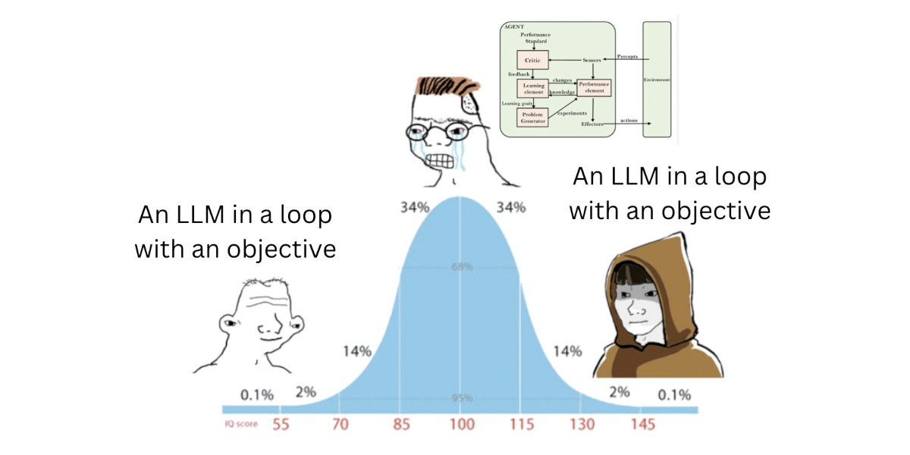
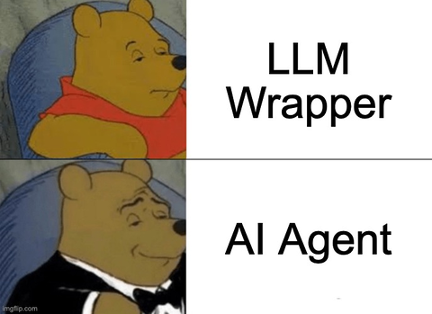
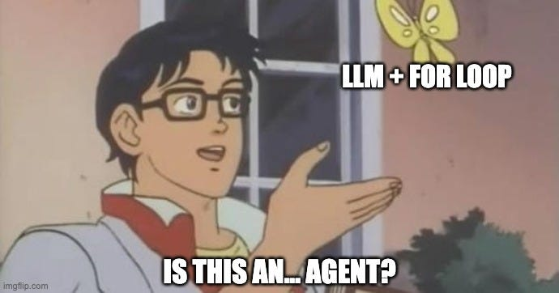
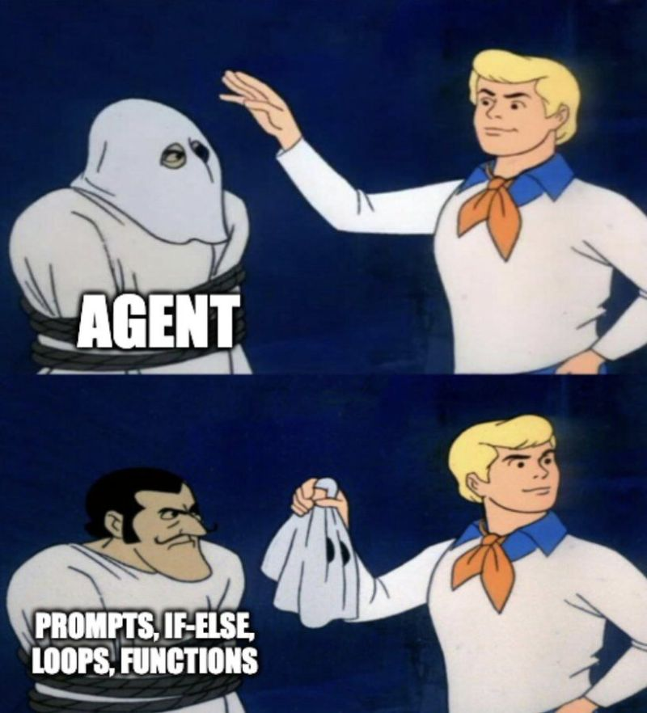
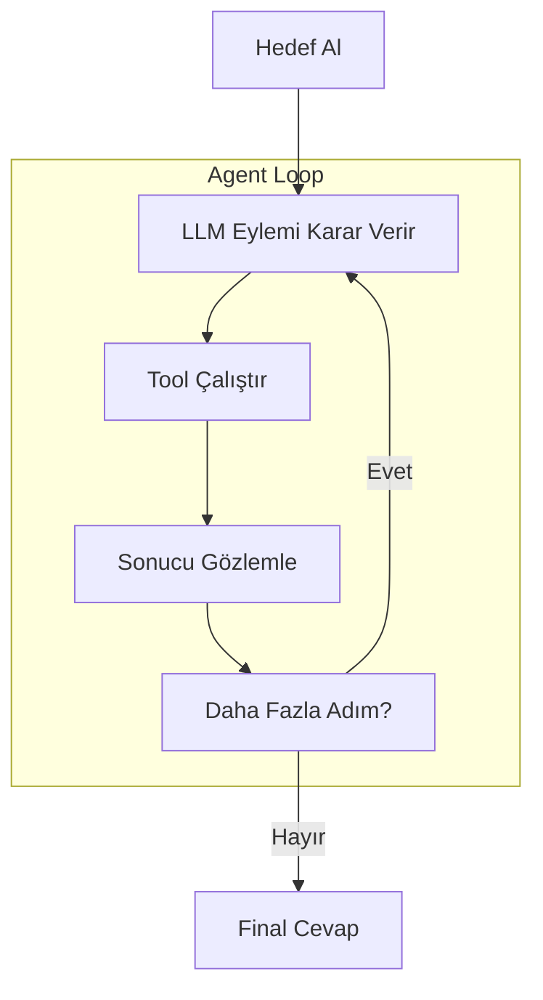
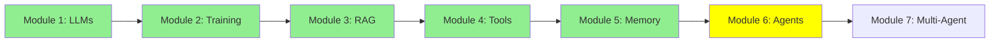

# Module 6: AI Agents: Tek Çağrıdan Çok Adımlı Akıl Yürütmeye

Merhaba! LLM'lerden fine-tuning'e, RAG'a ve tool'lara kadar ilerledik. Şimdi agent'lar—düşünen ve akıllı yardımcılar gibi davranan LLM'ler. Agent'lar büyük problemleri adım adım çözer. Parçalayalım!

## I. Giriş: Agent'ı Tanımlama

### A. Tek Dönüşün Ötesinde

LLM'ler basit soruları halleder, ama karmaşık görevler (bug düzeltmek veya kod tabanlarını analiz etmek gibi) planlama ve eylemler gerektirir. Bir **AI Agent**, hedeflere ulaşmak için tool'lar, hafıza ve döngü ile donatılmış bir LLM'dir.

### B. Analoji: LLM vs. Agent

- **LLM (Beyin)**: Metin girişi alır, metin çıkışı verir. Sadece bir nöral ağ çalışması.
- **Agent (İnsan Vücudu/Sistemi)**: LLM'yi bir döngü içine sarar. Tool'ları çağırır (eller), hatırlar (hafıza), bitene kadar devam eder.

Tool'lar "eller"—eylemler için fonksiyonlar.

LLM'yi beyin, agent'ı vücut, tool'ları insan vücudunun elleri veya ayakları olarak düşünebilirsin.

  
*Herkes agent'ların sihir olduğunu düşünüyor, ama onlar sadece akıllı LLM kurulumları!*

  
*LLM beyin olarak, agent vücut olarak!*

## II. Temel Mekanizma: Agent Loop

Agent'lar çok adımlı düşünme için **Observe-Decide-Act Loop** kullanır.

### A. Standart Observe-Decide-Act Akışı

1. **Hedef Alındı**: Kullanıcı hedef belirler (örn. "API endpoint'lerini özetle.").
2. **Karar Ver/Planla**: LLM düşünür, planlar, bir tool seçer.
3. **Eylem Yap**: Host tool'u çalıştırır.
4. **Gözlemle/Yansıt**: Tool sonucu hafızaya eklenir.
5. **Yeniden Değerlendir**: LLM ilerlemeyi kontrol eder, sonraki adımı karar verir.
6. **Sonlandır**: Hedef karşılandığında döngü biter, LLM final cevabı verir.

### B. Detaylı Çok Adımlı Örnek (Bug Düzeltme)

"kodundaki bug'u düzelt" için:

| Adım | Agent Eylemi | LLM Çağrısı |
|------|--------------|----------------|
| 0 | Hedef alındı | - |
| 1 | Kodu analiz et (read_file tool kullan) | Dosyaları okumak için çağrıldı |
| 2 | Test case yaz | Kod üretmek için çağrıldı |
| 3 | Düzeltme kodu yaz | Kod üretmek için çağrıldı |
| 4 | Testleri çalıştır (run_shell tool kullan) | Tool çağırmak için çağrıldı |
| 5 | Testler geçerse özetle | Özetlemek için çağrıldı |

Agent'lar LLM'leri birden çok kez çağırır; LLM'ler bir kez yapar.

Bu örnek, tek bir LLM'nin sadece bir kez çağrıldığını gösterirken, agent'ın hedefe ulaşmak için (bug çözmek) çoklu, kontrollü adımlarda LLM'leri birden çok kez çağırdığını gösterir.

Yani basitçe söylemek gerekirse:

- Bir LLM sadece metin girişi alıp metin çıkışı veren bir nöral ağ.

- Bir Agent, tool'lara erişimi olan ve bir hedefe ulaşılana kadar döngü içinde birden çok kez çağrılan bir LLM.

  
*Adımları iş başında gör!*

## III. Agent'ın System Prompt'u: LLM Hangi Tool'lara Sahip Olduğunu Nasıl Bilir?

Unutma, arka planda bir agent hâlâ "sadece" döngü içinde çağrılan bir LLM. O zaman LLM hangi tool'ları kullanmasına izin verildiğini nasıl biliyor?

Cevap: **system prompt**—döngüdeki her LLM çağrısından önce gönderilen bir talimat bloğu. Genellikle şunları içerir:
- Agent'ın rolü ve hedefi (örn. "Sen bir kodlama asistanısın.").
- Erişimi olan tool'ların listesi, her tool'un adı, açıklaması ve beklenen girdi/çıktılarıyla birlikte.
- Host programın ayrıştırıp çalıştırabilmesi için bir tool çağrısının nasıl biçimlendirileceğine dair talimatlar.

ASCII Art:
```
System Prompt:
  "Sen yardımcı bir asistansın.
   Şu tool'lara erişimin var:
   - read_file(filename): bir dosyayı okur ve içeriğini döndürür
   - run_shell(command): bir shell komutu çalıştırır ve çıktısını döndürür
   Bir tool kullanmak için şöyle yanıt ver: CALL <tool_adi>(<args>)"
Kullanıcı: "main.py'yi oku"
LLM: (system prompt'ta read_file'ı görür) --> "CALL read_file(main.py)"
```

**İyi haber**: bu tool listesini genelde elle yazmana gerek yok. Bir fonksiyonu `@tool` decorator'ı ile kaydettiğinde (Modül 4'te gördüğümüz gibi), smolagents gibi agent framework'leri fonksiyonun adını, docstring'ini ve girdilerini otomatik olarak okur ve bu tool tanımını doğrudan system prompt'a ekler. Sen sadece fonksiyonu yazarsın—LLM'ye onun var olduğunu söylemeyi framework halleder.

Modül 4'teki kodun bu kadar kısa olmasının sebebi bu: `@tool` decorator'ı sadece fonksiyonu kodunda kaydetmek için değil, aynı zamanda framework'ün LLM'ye "işte çağırabileceğin şeyler" diyen system prompt'u nasıl oluşturduğunun da bir parçası.

## IV. Agent Bileşenleri ve Uygulaması

### A. Temel Bileşenler

- **LLM (Beyin)**: Akıl yürütür, planlar, metin üretir.
- **Hafıza/Context**: Geçmişi hatırlamak için saklar.
- **Tool'lar**: Eylemler için fonksiyonlar.

### B. Uygulama Odak

Döngüler ve tool'lar için smol-agent gibi framework'ler kullan. Tool'ları ve prompt'ları tanımlamaya odaklan.

Kütüphaneler:
- [smolagents](https://github.com/huggingface/smolagents)
- [crewAI](https://github.com/crewAIInc/crewAI)
- [autogen](https://github.com/microsoft/autogen)

Temel kod snippet'leri (basit read_file tool kullanarak):

**smolagents**:
```python
from smolagents import CodeAgent, tool, HfApiModel

@tool
def read_file(filename: str) -> str:
    with open(filename, 'r') as f:
        return f.read()

agent = CodeAgent(tools=[read_file], model=HfApiModel())
result = agent.run("main.py'yi oku ve özetle")
```

**crewAI**:
```python
from crewai import Agent, Task, Crew

def read_file(filename: str) -> str:
    with open(filename, 'r') as f:
        return f.read()

agent = Agent(role="Reader", goal="Dosyaları oku", tools=[read_file])
task = Task(description="main.py'yi oku", agent=agent)
crew = Crew(agents=[agent], tasks=[task])
crew.kickoff()
```

**autogen**:
```python
from autogen import AssistantAgent, UserProxyAgent

def read_file(filename: str) -> str:
    with open(filename, 'r') as f:
        return f.read()

assistant = AssistantAgent("Helper", llm_config={"config_list": [...]})
user_proxy = UserProxyAgent("User", code_execution_config={"functions": [read_file]})
user_proxy.initiate_chat(assistant, message="main.py'yi oku")
```

  
*Agent'lar iş başında!*

## Mermaid Diyagramı: Agent Loop



## Eğitim İlerlemesi



## Özet

Agent'lar tool'lar ve hafıza ile döngülerdeki LLM'ler. Karmaşık görevleri hallederler. Sonra multi-agent sistemleri!

**Hızlı Kontrol**: Agent loop nedir?

Devam et! 🚀

**Önceki Modül:** [Modül 5: Memory](5_memory_tr.md)
**Sonraki Modül:** [Modül 7: Multi-Agent Architectures](7_multi_agent_tr.md)
