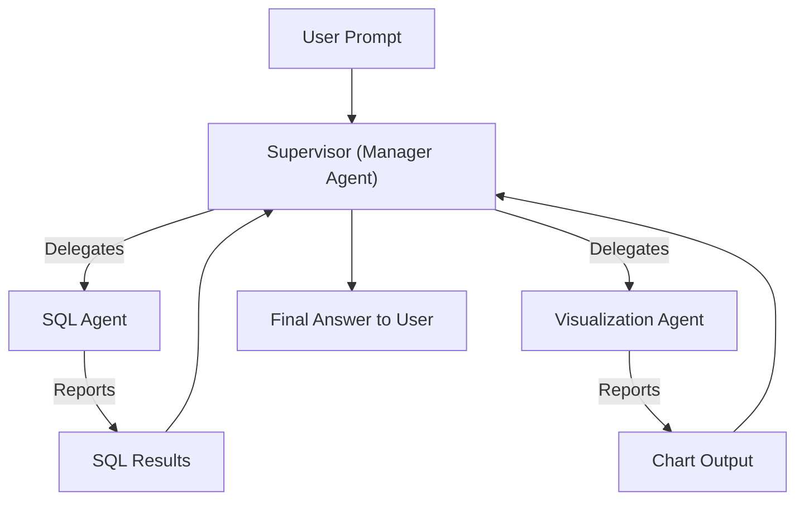
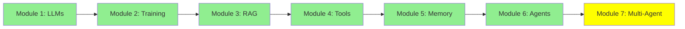

# Module 7: Multi-Agent Architectures

Hello! We've covered LLMs, fine-tuning, RAG, tools, and single agents. Now, for super complex tasks, we use multiple agents working together. This is multi-agent systems—teams of AI helpers. Let's learn how!

## I. The Problem: Task Complexity

Some tasks are too big for one agent. They mix different skills.

**Example Scenario**: User says: "How many rows are there in my database tables? Show them in a bar chart."

This needs two things:
1. Write SQL to query the database.
2. Visualize results as a bar chart.

**Single-Agent Issue**: One agent handling both SQL and visualization might get confused. It could mix up steps or make mistakes (hallucinate) because it's juggling two different jobs. The prompt would be huge, covering SQL and visualization in different domains.

ASCII Art:
```
Task: SQL + Chart
Single Agent: [Tries SQL] -> [Tries Chart] -> Messy!
Multi-Agent: Agent A does SQL -> Agent B does Chart -> Perfect!
```

## II. The Solution: Specialized Agents and Orchestration

### A. Specialized Agents

Use experts for each part:
- **SQL Agent**: Good at writing and running SQL queries.
- **Visualization Agent**: Expert at creating charts.

### B. Orchestration and Management

Route tasks smartly:
- For SQL only: Send to SQL Agent.
- For both: SQL Agent first, then pass results to Visualization Agent.

### C. The Manager Agent

A **Manager Agent** handles everything:
- Gets the user's prompt.
- Decides which worker agents to use.
- Delegates tasks.
- Collects results and gives the final answer.

For example, when the task requires only SQL querying, we route the task to the SQL Agent. If it requires both, we first route to the SQL Agent, and then the results route to the Visualization Agent.

This way, the user prompt is received first by the Manager Agent. The Manager Agent delegates the task to Worker Agents (the SQL Agent and Visualization Agent). The Manager Agent finally returns the results to the user.

This architecture is called Supervisor,  Manager-Worker, Orchestrator-Worker, or Master-Slave architecture.

## III. Multi-Agent Architectures

### A. Manager-Worker Architectures

Like above: Manager (boss) tells workers what to do. Also called Orchestrator-Worker or Supervisor.

### B. Other Architectures

- **Network (Swarm)**: Agents talk freely like a group chat.
- **Hierarchical**: Layers of managers and workers.
- **Agent-as-a-Tool**: One agent uses another as a tool.
- **Subagents (Deep Agents)**: Agents with mini-agents inside.

### C. Project Focus

We'll use a mix of Manager and Subagents for our projects.

Example Multi-Agent Architecture: [LangGraph Multi-Agent Concepts](https://langchain-ai.github.io/langgraph/concepts/multi_agent/)

## Code Snippets: Manager Architecture

**smolagents**:
```python
from smolagents import CodeAgent, tool, HfApiModel

@tool
def sql_query(query):
    # Run SQL
    return results

@tool
def visualize(data):
    # Make chart
    return chart

manager = CodeAgent(tools=[], model=HfApiModel())  # Manager delegates
sql_agent = CodeAgent(tools=[sql_query], model=HfApiModel())
viz_agent = CodeAgent(tools=[visualize], model=HfApiModel())

# Manager logic: Call sql_agent, then viz_agent
```

**crewAI**:
```python
from crewai import Agent, Task, Crew

sql_agent = Agent(role="SQL Expert", tools=[sql_query])
viz_agent = Agent(role="Visualizer", tools=[visualize])
manager = Agent(role="Manager", goal="Orchestrate tasks")

task1 = Task(description="Query DB", agent=sql_agent)
task2 = Task(description="Visualize", agent=viz_agent, context=[task1])

crew = Crew(agents=[manager, sql_agent, viz_agent], tasks=[task1, task2])
crew.kickoff()
```

**autogen**:
```python
from autogen import AssistantAgent, UserProxyAgent

sql_agent = AssistantAgent("SQL Agent", tools=[sql_query])
viz_agent = AssistantAgent("Viz Agent", tools=[visualize])
manager = AssistantAgent("Manager", tools=[])  # Delegates

user_proxy = UserProxyAgent("User")
user_proxy.initiate_chat(manager, message="Query and chart DB")
# Manager chats with sql_agent, then viz_agent
```

## Mermaid Diagram: Supervisor Architecture



## Tutorial Progress



## Summary

Multi-agents solve complex tasks by teamwork. You learned problems, solutions, architectures, and code. Now you're ready to build AI systems!

**Quick Check**: Why use multi-agents?

Congratulations! 🎉

**Previous Module:** [Module 6: AI Agents: From Single Call to Multi-Step Reasoning](6_agents.md)

**Next Category:** [Intermediate →](../intermediate/8_prompt_engineering.md)
