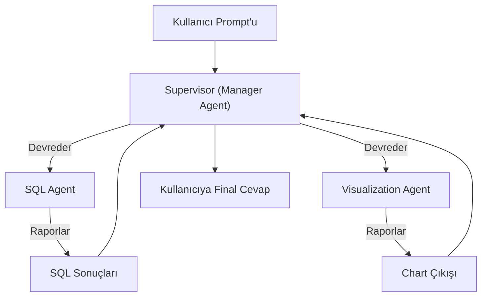
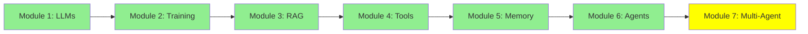

# Module 7: Multi-Agent Architectures

Merhaba! LLM'ler, fine-tuning, RAG, tool'lar ve tek agent'ları öğrendik. Şimdi, süper karmaşık görevler için birden çok agent'ın birlikte çalıştığı multi-agent sistemleri—AI yardımcıları takımları. Nasıl olduğunu öğrenelim!

## I. Problem: Görev Karmaşıklığı

Bazı görevler tek agent için çok büyük. Farklı becerileri karıştırırlar.

**Örnek Senaryo**: Kullanıcı der ki: "Veritabanı tablolarımda kaç satır var? Bar chart'ta göster."

Bu iki şey gerektirir:
1. Veritabanını sorgulamak için SQL yaz.
2. Sonuçları bar chart olarak görselleştir.

**Tek-Agent Sorunu**: Hem SQL hem görselleştirmeyi halleden tek agent karışabilir. Adımları karıştırabilir veya hatalar yapabilir (hallucinate) çünkü iki farklı işi birden yapıyor. Prompt devasa olur, SQL ve görselleştirmeyi farklı alanlarda kapsar.

ASCII Art:
```
Görev: SQL + Chart
Tek Agent: [SQL Dener] -> [Chart Dener] -> Karışık!
Multi-Agent: Agent A SQL yapar -> Agent B Chart yapar -> Mükemmel!
```

## II. Çözüm: Uzman Agent'lar ve Orkestrasyon

### A. Uzman Agent'lar

Her kısım için uzman kullan:
- **SQL Agent**: SQL sorguları yazmada ve çalıştırmada iyi.
- **Visualization Agent**: Chart'lar oluşturmada uzman.

### B. Orkestrasyon ve Yönetim

Görevleri akıllıca yönlendir:
- Sadece SQL için: SQL Agent'a gönder.
- İkisi için: Önce SQL Agent, sonra sonuçları Visualization Agent'a geçir.

### C. Manager Agent

Bir **Manager Agent** her şeyi halleder:
- Kullanıcının prompt'unu alır.
- Hangi worker agent'ları kullanacağını karar verir.
- Görevleri devreder.
- Sonuçları toplar ve final cevabı verir.

Örneğin, görev sadece SQL sorgulama gerektiriyorsa, görevi SQL Agent'a yönlendiririz. İkisi gerektiriyorsa, önce SQL Agent'a, sonra sonuçları Visualization Agent'a yönlendiririz.

Bu şekilde, kullanıcı prompt'u önce Manager Agent tarafından alınır. Manager Agent görevi Worker Agent'lara (SQL Agent ve Visualization Agent) devreder. Manager Agent sonunda sonuçları kullanıcıya döndürür.

Bu mimari Supervisor, Manager-Worker, Orchestrator-Worker veya Master-Slave mimarisi olarak adlandırılır.

## III. Multi-Agent Architectures

### A. Manager-Worker Architectures

Yukarıdaki gibi: Manager (patron) worker'lara ne yapacaklarını söyler. Ayrıca Orchestrator-Worker veya Supervisor olarak adlandırılır.

### B. Diğer Architectures

- **Network (Swarm)**: Agent'lar grup sohbeti gibi serbestçe konuşur.
- **Hierarchical**: Manager ve worker katmanları.
- **Agent-as-a-Tool**: Bir agent diğerini tool olarak kullanır.
- **Subagents (Deep Agents)**: İçinde mini-agent'ları olan agent'lar.

### C. Proje Odak

Projelerimiz için Manager ve Subagents karışımı kullanacağız.

Örnek Multi-Agent Architecture: [LangGraph Multi-Agent Concepts](https://langchain-ai.github.io/langgraph/concepts/multi_agent/)

## Kod Snippet'leri: Manager Architecture

**smolagents**:
```python
from smolagents import CodeAgent, tool, HfApiModel

@tool
def sql_query(query):
    # SQL çalıştır
    return results

@tool
def visualize(data):
    # Chart yap
    return chart

manager = CodeAgent(tools=[], model=HfApiModel())  # Manager devreder
sql_agent = CodeAgent(tools=[sql_query], model=HfApiModel())
viz_agent = CodeAgent(tools=[visualize], model=HfApiModel())

# Manager mantığı: sql_agent'ı çağır, sonra viz_agent'ı
```

**crewAI**:
```python
from crewai import Agent, Task, Crew

sql_agent = Agent(role="SQL Expert", tools=[sql_query])
viz_agent = Agent(role="Visualizer", tools=[visualize])
manager = Agent(role="Manager", goal="Görevleri orkestre et")

task1 = Task(description="DB Sorgula", agent=sql_agent)
task2 = Task(description="Görselleştir", agent=viz_agent, context=[task1])

crew = Crew(agents=[manager, sql_agent, viz_agent], tasks=[task1, task2])
crew.kickoff()
```

**autogen**:
```python
from autogen import AssistantAgent, UserProxyAgent

sql_agent = AssistantAgent("SQL Agent", tools=[sql_query])
viz_agent = AssistantAgent("Viz Agent", tools=[visualize])
manager = AssistantAgent("Manager", tools=[])  # Devreder

user_proxy = UserProxyAgent("User")
user_proxy.initiate_chat(manager, message="DB'yi sorgula ve chart yap")
# Manager sql_agent ile sohbet eder, sonra viz_agent ile
```

## Mermaid Diyagramı: Supervisor Architecture



## Eğitim İlerlemesi



## Özet

Multi-agent'lar takım çalışmasıyla karmaşık görevleri çözer. Problemleri, çözümleri, mimarileri ve kodu öğrendin. Şimdi AI sistemleri inşa etmeye hazırsın!

**Hızlı Kontrol**: Neden multi-agent kullan?

Tebrikler! 🎉

**Önceki Modül:** [Modül 6: AI Agents: Tek Çağrıdan Çok Adımlı Akıl Yürütmeye](6_agents_tr.md)

**Sonraki Kategori:** [Intermediate →](../intermediate/8_prompt_engineering_tr.md)
