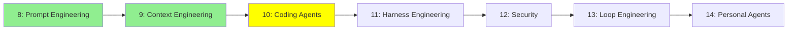

# Module 10: Coding Agents

*Category: Intermediate — Module 10 (3 of 7 in this category)*

*(Placeholder module — a short overview for now; full lesson content is coming soon.)*

How coding-specific agents (like Claude Code) get extended and customized beyond their built-in behavior.

**Topics this module will cover**:
- Slash Commands
- Skills
- AGENTS.md
- Subagents
- Hooks
- MCP
- Plugins

## Tutorial Progress

**Previous Module:** [Module 9: Context Engineering](9_context_engineering.md)
**Next Module:** [Module 11: Harness Engineering](11_harness_engineering.md)
