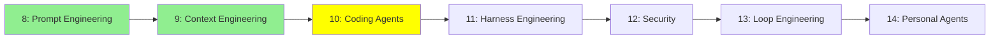

# Module 10: Coding Agent'lar

*Kategori: Intermediate — Modül 10 (bu kategoride 3/7)*

*(Bu bir placeholder modül — şimdilik kısa bir özet; tam ders içeriği yakında geliyor.)*

Claude Code gibi kodlama agent'larının, yerleşik davranışlarının ötesinde nasıl genişletildiği ve özelleştirildiği.

**Bu modülde işlenecek konular**:
- Slash Commands
- Skills
- AGENTS.md
- Subagents
- Hooks
- MCP
- Plugins

## Eğitim İlerlemesi

**Önceki Modül:** [Modül 9: Context Engineering](9_context_engineering_tr.md)
**Sonraki Modül:** [Modül 11: Harness Engineering](11_harness_engineering_tr.md)
