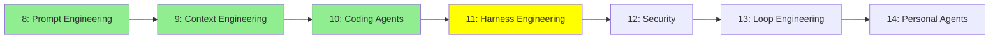

# Module 11: Harness Engineering

*Category: Intermediate — Module 11 (4 of 7 in this category)*

*(Placeholder module — a short overview for now; full lesson content is coming soon.)*

Designing the "harness" — the program that wraps the agent loop — so the agent runs safely and predictably.

**Topics this module will cover**:
- Guardrails
- Hooks
- Sandboxes

## Tutorial Progress

**Previous Module:** [Module 10: Coding Agents](10_coding_agents.md)
**Next Module:** [Module 12: Security](12_security.md)
