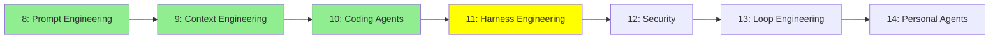

# Module 11: Harness Engineering

*Kategori: Intermediate — Modül 11 (bu kategoride 4/7)*

*(Bu bir placeholder modül — şimdilik kısa bir özet; tam ders içeriği yakında geliyor.)*

Agent loop'unu saran programın ('harness') tasarımı, ki agent güvenli ve öngörülebilir şekilde çalışsın.

**Bu modülde işlenecek konular**:
- Guardrails
- Hooks
- Sandboxes

## Eğitim İlerlemesi

**Önceki Modül:** [Modül 10: Coding Agent'lar](10_coding_agents_tr.md)
**Sonraki Modül:** [Modül 12: Güvenlik (Security)](12_security_tr.md)
