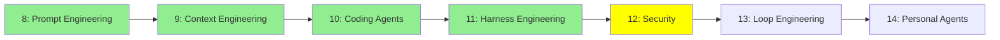

# Module 12: Security

*Category: Intermediate — Module 12 (5 of 7 in this category)*

*(Placeholder module — a short overview for now; full lesson content is coming soon.)*

Attacking and defending agents: how jailbreaks work, and how to test and guard against them.

**Topics this module will cover**:
- Jailbreaking
- White-box testing
- Black-box testing
- Guardrails

## Tutorial Progress

**Previous Module:** [Module 11: Harness Engineering](11_harness_engineering.md)
**Next Module:** [Module 13: Loop Engineering](13_loop_engineering.md)
