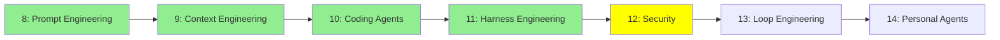

# Module 12: Güvenlik (Security)

*Kategori: Intermediate — Modül 12 (bu kategoride 5/7)*

*(Bu bir placeholder modül — şimdilik kısa bir özet; tam ders içeriği yakında geliyor.)*

Agent'lara saldırma ve onları savunma: jailbreak'lerin nasıl çalıştığı, ve onlara karşı nasıl test edilip korunulacağı.

**Bu modülde işlenecek konular**:
- Jailbreaking
- White-box testi
- Black-box testi
- Guardrails

## Eğitim İlerlemesi

**Önceki Modül:** [Modül 11: Harness Engineering](11_harness_engineering_tr.md)
**Sonraki Modül:** [Modül 13: Loop Engineering](13_loop_engineering_tr.md)
