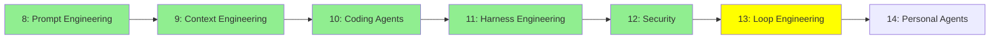

# Module 13: Loop Engineering

*Category: Intermediate — Module 13 (6 of 7 in this category)*

*(Placeholder module — a short overview for now; full lesson content is coming soon.)*

Going beyond a single agent loop: coordinating teams of agents and evaluating how well their runs actually go.

**Topics this module will cover**:
- Agent Teams
- Dynamic Workflows
- Rubric Evals

## Tutorial Progress

**Previous Module:** [Module 12: Security](12_security.md)
**Next Module:** [Module 14: Personal Agents](14_personal_agents.md)
