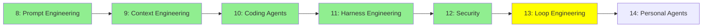

# Module 13: Loop Engineering

*Kategori: Intermediate — Modül 13 (bu kategoride 6/7)*

*(Bu bir placeholder modül — şimdilik kısa bir özet; tam ders içeriği yakında geliyor.)*

Tek bir agent loop'unun ötesine geçmek: agent takımlarını koordine etmek ve çalışmalarının gerçekte ne kadar iyi gittiğini değerlendirmek.

**Bu modülde işlenecek konular**:
- Agent Teams
- Dynamic Workflows
- Rubric Evals

## Eğitim İlerlemesi

**Önceki Modül:** [Modül 12: Güvenlik (Security)](12_security_tr.md)
**Sonraki Modül:** [Modül 14: Kişisel Agent'lar](14_personal_agents_tr.md)
