# Module 14: Personal Agents

*Category: Intermediate — Module 14 (7 of 7 in this category)*

*(Placeholder module — a short overview for now; full lesson content is coming soon.)*

Always-on, personal agents that run on your own devices and accounts rather than a shared service.

**Topics this module will cover**:
- Openclaw
- Hermes Agent
- Moltbook

## Tutorial Progress

```mermaid
graph LR
    A[8: Prompt Engineering] --> B[9: Context Engineering]
    B --> C[10: Coding Agents]
    C --> D[11: Harness Engineering]
    D --> E[12: Security]
    E --> F[13: Loop Engineering]
    F --> G[14: Personal Agents]
    style A fill:#90EE90
    style B fill:#90EE90
    style C fill:#90EE90
    style D fill:#90EE90
    style E fill:#90EE90
    style F fill:#90EE90
    style G fill:#FFFF00
```

**Previous Module:** [Module 13: Loop Engineering](13_loop_engineering.md)
**Next Module:** [Expert — Module 15: Advanced UI](../3_expert/15_advanced_ui.md)
