# Module 14: Kişisel Agent'lar

*Kategori: Intermediate — Modül 14 (bu kategoride 7/7)*

*(Bu bir placeholder modül — şimdilik kısa bir özet; tam ders içeriği yakında geliyor.)*

Paylaşılan bir servis değil de kendi cihazların/hesaplarında sürekli çalışan kişisel agent'lar.

**Bu modülde işlenecek konular**:
- Openclaw
- Hermes Agent
- Moltbook

## Eğitim İlerlemesi

```mermaid
graph LR
    A[8: Prompt Engineering] --> B[9: Context Engineering]
    B --> C[10: Coding Agents]
    C --> D[11: Harness Engineering]
    D --> E[12: Security]
    E --> F[13: Loop Engineering]
    F --> G[14: Personal Agents]
    style A fill:#90EE90
    style B fill:#90EE90
    style C fill:#90EE90
    style D fill:#90EE90
    style E fill:#90EE90
    style F fill:#90EE90
    style G fill:#FFFF00
```

**Önceki Modül:** [Modül 13: Loop Engineering](13_loop_engineering_tr.md)
**Sonraki Modül:** [Expert — Modül 15: İleri Seviye UI](../expert/15_advanced_ui_tr.md)
