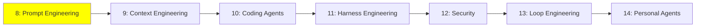

# Module 8: Prompt Engineering

*Category: Intermediate — Module 8 (1 of 7 in this category)*

*(Placeholder module — a short overview for now; full lesson content is coming soon.)*

Getting much better results out of a model without training it at all — just by designing the prompt itself well.

**Topics this module will cover**:
- Chain-of-Thought (CoT)
- In-Context Learning (few-shot examples)
- Other core prompting techniques

## Tutorial Progress

**Previous Module:** [Fundamentals — Module 7: Multi-Agent Architectures](../1_fundamentals/7_multi_agent.md)
**Next Module:** [Module 9: Context Engineering](9_context_engineering.md)
