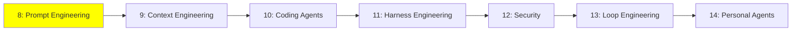

# Module 8: Prompt Engineering

*Kategori: Intermediate — Modül 8 (bu kategoride 1/7)*

*(Bu bir placeholder modül — şimdilik kısa bir özet; tam ders içeriği yakında geliyor.)*

Modeli hiç eğitmeden, sadece prompt'u iyi tasarlayarak ondan çok daha iyi sonuçlar almak.

**Bu modülde işlenecek konular**:
- Chain-of-Thought (CoT)
- In-Context Learning (prompt içine örnek koyma)
- Diğer temel prompting teknikleri

## Eğitim İlerlemesi

**Önceki Modül:** [Fundamentals — Modül 7: Multi-Agent Architectures](../fundamentals/7_multi_agent_tr.md)
**Sonraki Modül:** [Modül 9: Context Engineering](9_context_engineering_tr.md)
