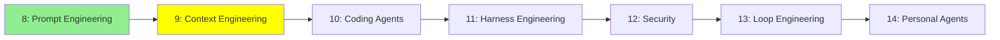

# Module 9: Context Engineering

*Category: Intermediate — Module 9 (2 of 7 in this category)*

*(Placeholder module — a short overview for now; full lesson content is coming soon.)*

Deciding what actually goes into an agent's limited context window, and how to keep it useful as a task grows long.

**Topics this module will cover**:
- Context summarization
- Persistent memory / context offloading (long-term memory)
- Subagents
- TODO lists / explicit planning

## Tutorial Progress

**Previous Module:** [Module 8: Prompt Engineering](8_prompt_engineering.md)
**Next Module:** [Module 10: Coding Agents](10_coding_agents.md)
