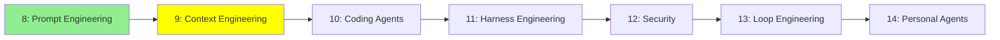

# Module 9: Context Engineering

*Kategori: Intermediate — Modül 9 (bu kategoride 2/7)*

*(Bu bir placeholder modül — şimdilik kısa bir özet; tam ders içeriği yakında geliyor.)*

Bir agent'ın sınırlı context window'una neyin gireceğine karar vermek, ve görev uzadıkça context'i kullanışlı tutmak.

**Bu modülde işlenecek konular**:
- Context özetleme
- Persistent memory / context offloading (uzun süreli hafıza)
- Subagent'lar
- TODO listeleri / açık planlama

## Eğitim İlerlemesi

**Önceki Modül:** [Modül 8: Prompt Engineering](8_prompt_engineering_tr.md)
**Sonraki Modül:** [Modül 10: Coding Agent'lar](10_coding_agents_tr.md)
