# Module 15: Advanced UI

*Category: Expert — Module 15 (1 of 9 in this category)*

*(Placeholder module — a short overview for now; full lesson content is coming soon.)*

UI that agents can drive or generate live, and the emerging protocols connecting agents to interfaces.

**Topics this module will cover**:
- Agentic UI
- Generative UI
- Event streaming
- AG-UI
- MCP-Apps UI
- A2UI
- CopilotKit
- Agent Client Protocol (ACP)

## Tutorial Progress

```mermaid
graph LR
    A[15: Advanced UI] --> B[16: Advanced Architectures]
    B --> C[17: Advanced Tools]
    C --> D[18: Advanced Memory]
    D --> E[19: Advanced Multi-Agent]
    E --> F[20: Advanced Prompting]
    F --> G[21: Adv. Context Eng.]
    G --> H[22: Adv. Harness Eng.]
    H --> I[23: Advanced Deployment]
    style A fill:#FFFF00
```

**Previous Module:** [Intermediate — Module 14: Personal Agents](../intermediate/14_personal_agents.md)
**Next Module:** [Module 16: Advanced Architectures](16_advanced_architectures.md)
