# Module 16: İleri Seviye Mimariler

*Kategori: Expert — Modül 16 (bu kategoride 2/9)*

*(Bu bir placeholder modül — şimdilik kısa bir özet; tam ders içeriği yakında geliyor.)*

Modül 6'daki temel Observe-Decide-Act loop'unun ötesine geçen mimari desenler.

**Bu modülde işlenecek konular**:
- THREAD
- ReAct
- CodeAct
- RLM
- Dynamic Workflows

## Eğitim İlerlemesi

```mermaid
graph LR
    A[15: Advanced UI] --> B[16: Advanced Architectures]
    B --> C[17: Advanced Tools]
    C --> D[18: Advanced Memory]
    D --> E[19: Advanced Multi-Agent]
    E --> F[20: Advanced Prompting]
    F --> G[21: Adv. Context Eng.]
    G --> H[22: Adv. Harness Eng.]
    H --> I[23: Advanced Deployment]
    style A fill:#90EE90
    style B fill:#FFFF00
```

**Önceki Modül:** [Modül 15: İleri Seviye UI](15_advanced_ui_tr.md)
**Sonraki Modül:** [Modül 17: İleri Seviye Tool'lar](17_advanced_tools_tr.md)
