# Module 17: Advanced Tools

*Category: Expert — Module 17 (3 of 9 in this category)*

*(Placeholder module — a short overview for now; full lesson content is coming soon.)*

Deeper tool-design decisions that matter once an agent's toolset gets large or performance-sensitive.

**Topics this module will cover**:
- RAG vs. Agentic Search
- JSON vs. CLI tools
- Frontend Tools
- Code Mode

## Tutorial Progress

```mermaid
graph LR
    A[15: Advanced UI] --> B[16: Advanced Architectures]
    B --> C[17: Advanced Tools]
    C --> D[18: Advanced Memory]
    D --> E[19: Advanced Multi-Agent]
    E --> F[20: Advanced Prompting]
    F --> G[21: Adv. Context Eng.]
    G --> H[22: Adv. Harness Eng.]
    H --> I[23: Advanced Deployment]
    style A fill:#90EE90
    style B fill:#90EE90
    style C fill:#FFFF00
```

**Previous Module:** [Module 16: Advanced Architectures](16_advanced_architectures.md)
**Next Module:** [Module 18: Advanced Memory](18_advanced_memory.md)
