# Module 17: İleri Seviye Tool'lar

*Kategori: Expert — Modül 17 (bu kategoride 3/9)*

*(Bu bir placeholder modül — şimdilik kısa bir özet; tam ders içeriği yakında geliyor.)*

Bir agent'ın tool seti büyüdüğünde veya performans önem kazandığında devreye giren daha derin tool tasarım kararları.

**Bu modülde işlenecek konular**:
- RAG vs Agentic Search
- JSON vs CLI tool'lar
- Frontend Tools
- Code Mode

## Eğitim İlerlemesi

```mermaid
graph LR
    A[15: Advanced UI] --> B[16: Advanced Architectures]
    B --> C[17: Advanced Tools]
    C --> D[18: Advanced Memory]
    D --> E[19: Advanced Multi-Agent]
    E --> F[20: Advanced Prompting]
    F --> G[21: Adv. Context Eng.]
    G --> H[22: Adv. Harness Eng.]
    H --> I[23: Advanced Deployment]
    style A fill:#90EE90
    style B fill:#90EE90
    style C fill:#FFFF00
```

**Önceki Modül:** [Modül 16: İleri Seviye Mimariler](16_advanced_architectures_tr.md)
**Sonraki Modül:** [Modül 18: İleri Seviye Hafıza](18_advanced_memory_tr.md)
