# Module 18: Advanced Memory

*Category: Expert — Module 18 (4 of 9 in this category)*

*(Placeholder module — a short overview for now; full lesson content is coming soon.)*

Long-term memory systems that live outside the context window entirely, referenced back in Module 5.

**Topics this module will cover**:
- Cognee
- MemSearch
- Hindsight
- Agent Dreaming
- Agent KnowledgeBase
- Entire Provenance

## Tutorial Progress

```mermaid
graph LR
    A[15: Advanced UI] --> B[16: Advanced Architectures]
    B --> C[17: Advanced Tools]
    C --> D[18: Advanced Memory]
    D --> E[19: Advanced Multi-Agent]
    E --> F[20: Advanced Prompting]
    F --> G[21: Adv. Context Eng.]
    G --> H[22: Adv. Harness Eng.]
    H --> I[23: Advanced Deployment]
    style A fill:#90EE90
    style B fill:#90EE90
    style C fill:#90EE90
    style D fill:#FFFF00
```

**Previous Module:** [Module 17: Advanced Tools](17_advanced_tools.md)
**Next Module:** [Module 19: Advanced Multi-Agent](19_advanced_multiagent.md)
