# Module 18: İleri Seviye Hafıza

*Kategori: Expert — Modül 18 (bu kategoride 4/9)*

*(Bu bir placeholder modül — şimdilik kısa bir özet; tam ders içeriği yakında geliyor.)*

Modül 5'te bahsedilen, context window'un tamamen dışında yaşayan uzun süreli hafıza sistemleri.

**Bu modülde işlenecek konular**:
- Cognee
- MemSearch
- Hindsight
- Agent Dreaming
- Agent KnowledgeBase
- Entire Provenance

## Eğitim İlerlemesi

```mermaid
graph LR
    A[15: Advanced UI] --> B[16: Advanced Architectures]
    B --> C[17: Advanced Tools]
    C --> D[18: Advanced Memory]
    D --> E[19: Advanced Multi-Agent]
    E --> F[20: Advanced Prompting]
    F --> G[21: Adv. Context Eng.]
    G --> H[22: Adv. Harness Eng.]
    H --> I[23: Advanced Deployment]
    style A fill:#90EE90
    style B fill:#90EE90
    style C fill:#90EE90
    style D fill:#FFFF00
```

**Önceki Modül:** [Modül 17: İleri Seviye Tool'lar](17_advanced_tools_tr.md)
**Sonraki Modül:** [Modül 19: İleri Seviye Multi-Agent](19_advanced_multiagent_tr.md)
