# Module 19: Advanced Multi-Agent

*Category: Expert — Module 19 (5 of 9 in this category)*

*(Placeholder module — a short overview for now; full lesson content is coming soon.)*

Agent-to-Agent protocols and coordination patterns beyond the Manager-Worker setup from Module 7.

**Topics this module will cover**:
- A2A
- Context delegation vs. subagent context delegation vs. messaging pool

## Tutorial Progress

```mermaid
graph LR
    A[15: Advanced UI] --> B[16: Advanced Architectures]
    B --> C[17: Advanced Tools]
    C --> D[18: Advanced Memory]
    D --> E[19: Advanced Multi-Agent]
    E --> F[20: Advanced Prompting]
    F --> G[21: Adv. Context Eng.]
    G --> H[22: Adv. Harness Eng.]
    H --> I[23: Advanced Deployment]
    style A fill:#90EE90
    style B fill:#90EE90
    style C fill:#90EE90
    style D fill:#90EE90
    style E fill:#FFFF00
```

**Previous Module:** [Module 18: Advanced Memory](18_advanced_memory.md)
**Next Module:** [Module 20: Advanced Prompting](20_advanced_prompting.md)
