# Module 20: İleri Seviye Prompting

*Kategori: Expert — Modül 20 (bu kategoride 6/9)*

*(Bu bir placeholder modül — şimdilik kısa bir özet; tam ders içeriği yakında geliyor.)*

Modül 8'deki temellerin çok ötesine geçen akıl yürütme ve prompting stratejileri.

**Bu modülde işlenecek konular**:
- Reflexion
- Tree of Thought
- LLM Council
- Caveman
- Ponytail

## Eğitim İlerlemesi

```mermaid
graph LR
    A[15: Advanced UI] --> B[16: Advanced Architectures]
    B --> C[17: Advanced Tools]
    C --> D[18: Advanced Memory]
    D --> E[19: Advanced Multi-Agent]
    E --> F[20: Advanced Prompting]
    F --> G[21: Adv. Context Eng.]
    G --> H[22: Adv. Harness Eng.]
    H --> I[23: Advanced Deployment]
    style A fill:#90EE90
    style B fill:#90EE90
    style C fill:#90EE90
    style D fill:#90EE90
    style E fill:#90EE90
    style F fill:#FFFF00
```

**Önceki Modül:** [Modül 19: İleri Seviye Multi-Agent](19_advanced_multiagent_tr.md)
**Sonraki Modül:** [Modül 21: İleri Seviye Context Engineering](21_advanced_context_engineering_tr.md)
