# Module 22: İleri Seviye Harness Engineering

*Kategori: Expert — Modül 22 (bu kategoride 8/9)*

*(Bu bir placeholder modül — şimdilik kısa bir özet; tam ders içeriği yakında geliyor.)*

Modül 11'deki guardrail/hook/sandbox temellerinin ötesinde, harness'ın kendisini ince ayarlamak.

**Bu modülde işlenecek konular**:
- Harness profilleri
- System prompt'lar
- Tool isimlerini/şekillerini bağlama göre değiştirme

## Eğitim İlerlemesi

```mermaid
graph LR
    A[15: Advanced UI] --> B[16: Advanced Architectures]
    B --> C[17: Advanced Tools]
    C --> D[18: Advanced Memory]
    D --> E[19: Advanced Multi-Agent]
    E --> F[20: Advanced Prompting]
    F --> G[21: Adv. Context Eng.]
    G --> H[22: Adv. Harness Eng.]
    H --> I[23: Advanced Deployment]
    style A fill:#90EE90
    style B fill:#90EE90
    style C fill:#90EE90
    style D fill:#90EE90
    style E fill:#90EE90
    style F fill:#90EE90
    style G fill:#90EE90
    style H fill:#FFFF00
```

**Önceki Modül:** [Modül 21: İleri Seviye Context Engineering](21_advanced_context_engineering_tr.md)
**Sonraki Modül:** [Modül 23: İleri Seviye Deployment](23_advanced_deployment_tr.md)
