# Module 23: Advanced Deployment

*Category: Expert — Module 23 (9 of 9 in this category)*

*(Placeholder module — a short overview for now; full lesson content is coming soon.)*

Running agents as real production services rather than one-off scripts or chat sessions.

**Topics this module will cover**:
- Agent servers
- LangChain Agent Protocol

## Tutorial Progress

```mermaid
graph LR
    A[15: Advanced UI] --> B[16: Advanced Architectures]
    B --> C[17: Advanced Tools]
    C --> D[18: Advanced Memory]
    D --> E[19: Advanced Multi-Agent]
    E --> F[20: Advanced Prompting]
    F --> G[21: Adv. Context Eng.]
    G --> H[22: Adv. Harness Eng.]
    H --> I[23: Advanced Deployment]
    style A fill:#90EE90
    style B fill:#90EE90
    style C fill:#90EE90
    style D fill:#90EE90
    style E fill:#90EE90
    style F fill:#90EE90
    style G fill:#90EE90
    style H fill:#90EE90
    style I fill:#FFFF00
```

**Previous Module:** [Module 22: Advanced Harness Engineering](22_advanced_harness_engineering.md)
**Next Module:** [Ecosystem — Module 24: Agent Frameworks](../ecosystem/24_agent_frameworks.md)
