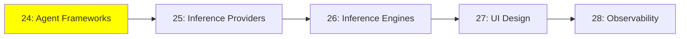

# Module 24: Agent Framework'leri

*Kategori: Ecosystem — Modül 24 (bu kategoride 1/5)*

*(Bu bir placeholder modül — şimdilik kısa bir özet; tam ders içeriği yakında geliyor.)*

İnsanların agent inşa etmek için gerçekten kullandığı framework'lerin bir turu, ve birbirlerinden farkları.

**Bu modülde işlenecek konular**:
- LangChain
- Agno
- CrewAI
- smolagents
- Mastra
- VoltAgent
- PydanticAI

## Eğitim İlerlemesi

**Önceki Modül:** [Expert — Modül 23: İleri Seviye Deployment](../expert/23_advanced_deployment_tr.md)
**Sonraki Modül:** [Modül 25: Inference Sağlayıcıları](25_inference_providers_tr.md)
