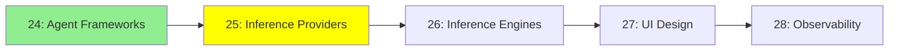

# Module 25: Inference Sağlayıcıları

*Kategori: Ecosystem — Modül 25 (bu kategoride 2/5)*

*(Bu bir placeholder modül — şimdilik kısa bir özet; tam ders içeriği yakında geliyor.)*

Kendi donanımını çalıştırmana gerek kalmadan LLM inference'ı API olarak sunan hizmetler.

**Bu modülde işlenecek konular**:
- OpenRouter
- OpenAI
- Google AI Studio

## Eğitim İlerlemesi

**Önceki Modül:** [Modül 24: Agent Framework'leri](24_agent_frameworks_tr.md)
**Sonraki Modül:** [Modül 26: Inference Motorları](26_inference_engines_tr.md)
