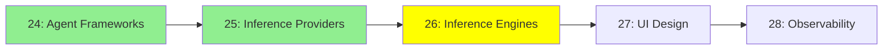

# Module 26: Inference Engines

*Category: Ecosystem — Module 26 (3 of 5 in this category)*

*(Placeholder module — a short overview for now; full lesson content is coming soon.)*

Software for running models yourself, from a laptop GUI to production-grade serving stacks.

**Topics this module will cover**:
- Ollama
- LM Studio
- Open WebUI
- llama.cpp
- TensorRT
- llm-d

## Tutorial Progress

**Previous Module:** [Module 25: Inference Providers](25_inference_providers.md)
**Next Module:** [Module 27: UI Design](27_ui_design.md)
