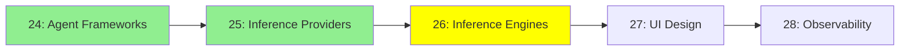

# Module 26: Inference Motorları

*Kategori: Ecosystem — Modül 26 (bu kategoride 3/5)*

*(Bu bir placeholder modül — şimdilik kısa bir özet; tam ders içeriği yakında geliyor.)*

Modelleri kendin çalıştırmak için kullanılan yazılımlar; bir laptop GUI'sinden production-seviyesi serving stack'lerine kadar.

**Bu modülde işlenecek konular**:
- Ollama
- LM Studio
- Open WebUI
- llama.cpp
- TensorRT
- llm-d

## Eğitim İlerlemesi

**Önceki Modül:** [Modül 25: Inference Sağlayıcıları](25_inference_providers_tr.md)
**Sonraki Modül:** [Modül 27: UI Tasarımı](27_ui_design_tr.md)
