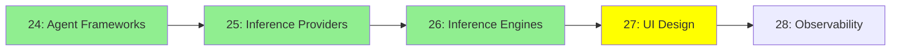

# Module 27: UI Design

*Category: Ecosystem — Module 27 (4 of 5 in this category)*

*(Placeholder module — a short overview for now; full lesson content is coming soon.)*

Tools and practices for designing agent-facing or agent-built interfaces.

**Topics this module will cover**:
- Stitch
- Claude's design tooling
- Design Systems
- DESIGN.md

## Tutorial Progress

**Previous Module:** [Module 26: Inference Engines](26_inference_engines.md)
**Next Module:** [Module 28: Observability](28_observability.md)
