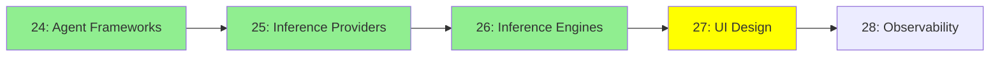

# Module 27: UI Tasarımı

*Kategori: Ecosystem — Modül 27 (bu kategoride 4/5)*

*(Bu bir placeholder modül — şimdilik kısa bir özet; tam ders içeriği yakında geliyor.)*

Agent'a yönelik veya agent tarafından inşa edilen arayüzleri tasarlama araçları ve pratikleri.

**Bu modülde işlenecek konular**:
- Stitch
- Claude'un tasarım araçları
- Design System'ler
- DESIGN.md

## Eğitim İlerlemesi

**Önceki Modül:** [Modül 26: Inference Motorları](26_inference_engines_tr.md)
**Sonraki Modül:** [Modül 28: Observability (Gözlemlenebilirlik)](28_observability_tr.md)
