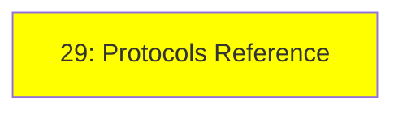

# Module 29: Protocols Reference

*Category: Protocols & Specs — Module 29 (1 of 1 in this category)*

*(Placeholder module — a short overview for now; full lesson content is coming soon.)*

A single reference page collecting every protocol mentioned across the series (MCP, A2A, ACP, AG-UI, and more), plus a few extra ones worth knowing.

**Topics this module will cover**:
- Every protocol mentioned in this series
- NLWeb
- UCP
- AP2

## Tutorial Progress

**Previous Module:** [Ecosystem — Module 28: Observability](../4_ecosystem/28_observability.md)
**Next Module:** [Optional — Module 30: Human-in-the-Loop](../6_optional/30_human_in_the_loop.md)
