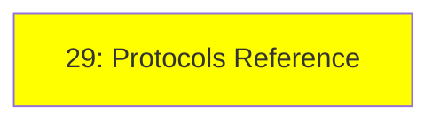

# Module 29: Protokol Referansı

*Kategori: Protocols & Specs — Modül 29 (bu kategoride 1/1)*

*(Bu bir placeholder modül — şimdilik kısa bir özet; tam ders içeriği yakında geliyor.)*

Seri boyunca bahsedilen tüm protokolleri (MCP, A2A, ACP, AG-UI ve daha fazlası) tek bir sayfada toplayan, ve bilinmeye değer birkaç ekstra protokolü de ekleyen bir referans.

**Bu modülde işlenecek konular**:
- Bu seride bahsedilen her protokol
- NLWeb
- UCP
- AP2

## Eğitim İlerlemesi

**Önceki Modül:** [Ecosystem — Modül 28: Observability (Gözlemlenebilirlik)](../ecosystem/28_observability_tr.md)
**Sonraki Modül:** [Optional — Modül 30: Human-in-the-Loop](../optional/30_human_in_the_loop_tr.md)
