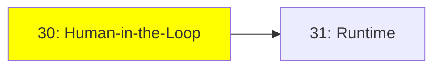

# Module 30: Human-in-the-Loop

*Category: Optional — Module 30 (1 of 2 in this category)*

*(Placeholder module — a short overview for now; full lesson content is coming soon.)*

Keeping a human in control of a running agent instead of letting it run fully autonomously.

**Topics this module will cover**:
- Interrupt
- Steering

## Tutorial Progress

**Previous Module:** [Protocols & Specs — Module 29: Protocols Reference](../5_protocols_specs/29_protocols_reference.md)
**Next Module:** [Module 31: Runtime](31_runtime.md)
