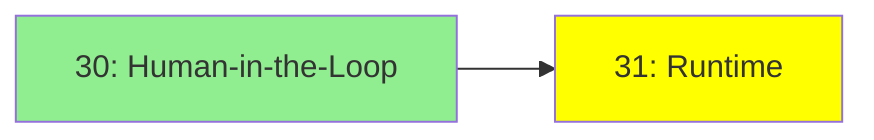

# Module 31: Runtime

*Category: Optional — Module 31 (2 of 2 in this category)*

*(Placeholder module — a short overview for now; full lesson content is coming soon.)*

The infrastructure question of running agents reliably over long, failure-prone tasks.

**Topics this module will cover**:
- Checkpoints
- Fault Tolerance
- Time Travel

## Tutorial Progress

**Previous Module:** [Module 30: Human-in-the-Loop](30_human_in_the_loop.md)
